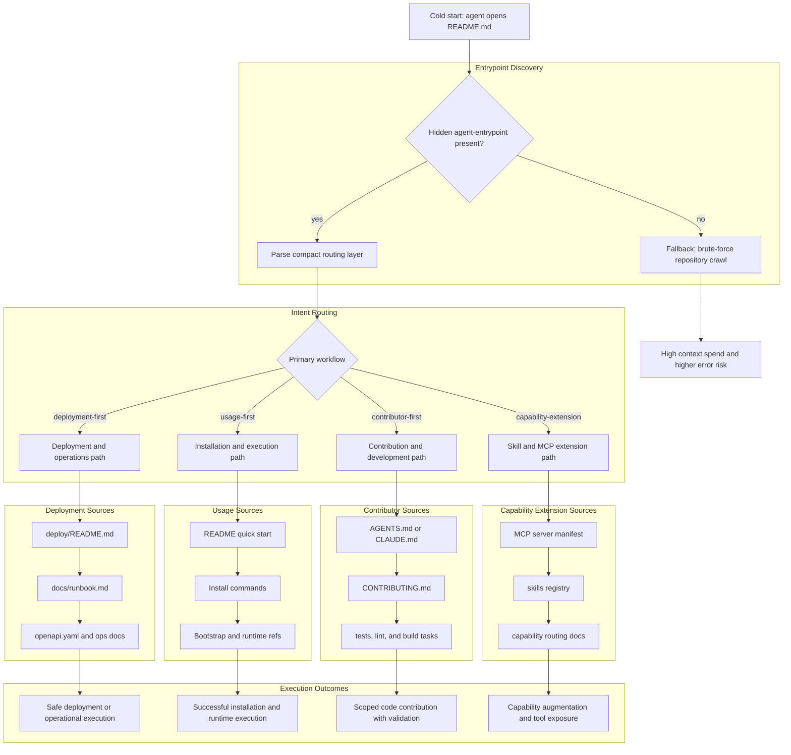

AI agents entering a repository cold waste large amounts of context reconstructing repository intent, topology, and authoritative workflows. Humans do this naturally through exploration. Agents pay for it directly in tokens, latency, and incorrect assumptions.

An **agent entrypoint** is a compact machine-oriented routing layer embedded at the top of a repository `README.md`. Its purpose is to minimize exploratory context spend and direct agents toward authoritative operational paths immediately.

The goal is not to teach the agent the repository. The goal is to route the agent toward the correct sources of truth as quickly as possible.

This distills into a single question:

> “How do I compress the minimum viable understanding of a repository into the fewest tokens possible while preserving reliable navigation and correct usage?”

<!--more-->

## About

An agent entrypoint is intentionally simple. It is just a hidden comment placed at the very top of the root `README.md`.

The entrypoint tells an agent:

* what kind of repository this is
* which workflows matter first
* where the authoritative operational documents live
* how to bootstrap successfully
* how to avoid speculative repository crawling

This is not a replacement for:

* `README.md`
* `AGENTS.md`
* `CLAUDE.md`
* architecture documents
* operational runbooks
* contribution guides

Instead, it supplements them.

The README remains the human entry page. The agent entrypoint becomes the machine-oriented routing layer that says:

> start here, then go there.

A well-designed entrypoint can compress:

* 5–20 minutes of repository exploration

into:

* ~100–300 highly optimized tokens

That matters because early repository exploration has extremely poor token efficiency. Most of the cost comes from uncertainty reduction rather than actual execution.

## Why This Exists

Modern AI coding agents already consume repositories similarly to humans:

1. Open the README
2. Infer project purpose
3. Search for installation paths
4. Locate operational conventions
5. Identify authoritative documentation
6. Begin execution or modification

The difference is economic.

Humans tolerate exploratory overhead naturally. Agents pay for it directly in:

* tokens
* latency
* context fragmentation
* incorrect early assumptions

A cold-start agent often spends most of its initial context budget answering questions the repository already implicitly knows:

* Is this deployable software or a reusable library?
* Where is the operational source of truth?
* Which files are authoritative?
* What workflow matters first?
* Is this repository optimized for usage, deployment, contribution, or extension?

An agent entrypoint compresses those answers into a deterministic routing layer.

That changes repository traversal from speculative exploration into directed execution.

## Why Hidden README Comments Work So Well

A hidden top-level README comment has several properties that are difficult to beat while requiring almost zero ecosystem coordination.

### ✅ Near-Zero Friction

No:

* new specification
* plugin
* MCP integration
* tool support
* ecosystem adoption effort

It works immediately because:

* agents already ingest README files first
* raw markdown includes comments
* humans typically never see rendered comments

### ✅ Perfect Placement in the Cognitive Pipeline

The routing layer should appear before exploration begins.

The top of `README.md` is exactly where first-pass repository comprehension occurs.

That means the agent receives:

* repository identity
* topology hints
* traversal anchors
* operational priorities

before wasting tokens scanning trees or opening irrelevant files.

### ✅ Human-Safe by Default

Because the entrypoint is hidden:

* it avoids cluttering onboarding documentation
* it does not overwhelm human readers
* it preserves normal README flow

This is actually a major ergonomic advantage.

## Cold-Start Repository Traversal Without an Entrypoint

Without an agent entrypoint, a remote AI agent typically has to reconstruct repository intent heuristically.

A common cold-start traversal path looks something like this:

```text
1. Open README.md
2. Infer repository type from prose
3. Crawl file tree
4. Search for:
   - package manifests
   - deployment configs
   - CI pipelines
   - AGENTS.md / CLAUDE.md
   - examples/
   - docs/
5. Guess dominant workflow
6. Inspect tests for behavioral hints
7. Infer operational entrypoints
8. Attempt execution
9. Recover from incorrect assumptions
```

This process is expensive because repositories are optimized for human familiarity, not deterministic machine traversal.

The result is:

* unnecessary token consumption
* duplicated repository analysis
* inconsistent execution paths
* increased hallucination risk
* incorrect workflow prioritization

Two agents consuming the same repository may arrive at completely different operational conclusions depending on traversal order and available context.

An agent entrypoint reduces this ambiguity by explicitly declaring:

* repository intent
* authoritative files
* primary operational paths
* preferred traversal order

That transforms repository onboarding from heuristic discovery into deterministic routing.

## Repository Traversal Workflow

A well-designed agent entrypoint should bias agents toward the repository’s primary operational workflow immediately.

Unless explicitly declared otherwise, the default traversal order should prioritize:

1. Deployment and operations
2. Usage and execution
3. Contribution and development

The goal is simple:

> an agent should become operationally useful before it becomes structurally knowledgeable.



## The Rules

If you are going to add an agent entrypoint, do it with discipline.

### 1. Keep the README Focused

The README should answer:

* what the project is
* how to use it
* where to go next

It should not become a procedural dump of every internal detail.

### 2. Put the Entrypoint at the Very Top

If an agent opens the file cold, the first meaningful thing it should encounter should be the machine routing layer.

### 3. Point Outward Instead of Repeating Content

The entrypoint should not duplicate README information that is already in context.

It should route agents toward authoritative sources rather than restating them.

### 4. Optimize for Operational Success First

Deployment, installation, invocation, and runtime operations should come before contributor workflows or implementation details.

### 5. Name Authoritative Files Explicitly

If the real source of conventions is:

* `AGENTS.md`
* `CLAUDE.md`
* `docs/agents.md`
* `MODULES.md`
* generated catalogs

then say so directly.

### 6. Keep It Small and Structured

The goal is deterministic routing, not prose.

Prefer concise keys over paragraphs.

### 7. Make the Traversal Path Obvious

A cold-start agent should identify the dominant workflow in seconds, not minutes.

## Use First, Development Second

The entrypoint should not behave like a contributor handbook.

It should optimize for the first operationally meaningful action.

For an application, that usually means:

* deploy
* configure
* run
* operate

For a library:

* install
* import
* execute
* validate

For infrastructure:

* provision
* apply
* verify safely

Contributor workflows matter, but they are secondary.

An agent that cannot determine whether the repository is meant to be consumed, deployed, extended, or maintained will waste context making incorrect assumptions.

## Concrete Entry Patterns

Here are several example repository types and how an agent entrypoint may be structured.

### Shared Terraform Module Repository

```md
<!-- agent-entrypoint:
intent: reusable-infrastructure
primary_workflow: usage-first

authoritative:
  - ./MODULES.json
  - ./MODULES.md
  - ./AGENTS.md
  - ./CLAUDE.md

examples:
  - ./examples/

validation:
  - terraform validate
  - terraform test
-->
```

This pattern works well for a shared module catalog because the agent immediately learns:

* this is reusable infrastructure
* modules are indexed externally
* conventions are centralized
* examples are authoritative usage references

The repository is treated as a reusable artifact inventory rather than a deployable application.

### Open Source CLI Tool

```md
<!-- agent-entrypoint:
intent: executable-tool
primary_workflow: usage-first

install:
  - uv tool install metagit-cli

bootstrap:
  - export METAGIT_AGENT_MODE=true
  - metagit context pack --tier 2 --json

authoritative:
  - ./AGENTS.md
  - ./docs/agents.md
  - ./llms.txt

usage:
  - ./README.md#quick-start
-->
```

This pattern immediately tells the agent:

* how to install the tool
* how to initialize agent mode
* which documents define operational conventions
* where the quick-start path lives

That allows the agent to become operational before exploring implementation details.

### Deployable Web Service

```md
<!-- agent-entrypoint:
intent: deployable-service
primary_workflow: deployment-first

deploy:
  - ./deploy/README.md

operations:
  - ./docs/runbook.md
  - ./docs/operations.md

interfaces:
  - ./openapi.yaml

development:
  - ./CONTRIBUTING.md
-->
```

This pattern is optimized for operators and integration agents.

The ordering is intentional:

1. deploy
2. operate
3. integrate
4. contribute

### Shared Library

```md
<!-- agent-entrypoint:
intent: reusable-library
primary_workflow: usage-first

package:
  - ./pyproject.toml

usage:
  - ./README.md#usage

examples:
  - ./examples/

validation:
  - ./tests/

conventions:
  - ./AGENTS.md
-->
```

This tells the agent the repository is intended for consumption rather than deployment.

The traversal path becomes:

1. identify package metadata
2. learn usage patterns
3. inspect examples
4. validate expected behavior

### Skills Repository with an MCP Server

```md
<!-- agent-entrypoint:
intent: agent-augmentation
primary_workflow: capability-extension

mcp:
  server: ./mcp/server.py
  transport: stdio
  manifest: ./mcp/mcp.json

skills:
  registry: ./skills/
  routing: ./skills/ROUTING.md
  conventions: ./skills/CONVENTIONS.md

bootstrap:
  - uv sync
  - uv run python ./mcp/server.py

authoritative:
  - ./AGENTS.md
  - ./docs/capabilities.md
-->
```

This repository is not primarily meant for direct human execution.

It exists to extend another agent runtime through:

* skills
* MCP capabilities
* routing logic
* operational augmentation

The entrypoint immediately tells an agent:

* where the MCP server lives
* how capabilities are exposed
* where skill routing logic exists
* how to bootstrap the runtime
* which files define behavioral conventions

Without this guidance, an agent may incorrectly treat the repository as a standalone application instead of a capability extension layer.

## What Good Looks Like

A good agent entrypoint should:

* fit comfortably within a few hundred tokens
* expose operational intent immediately
* minimize ambiguity
* point outward toward authoritative sources
* avoid duplicating existing documentation
* remain stable even as repository internals evolve

If the entrypoint becomes large, the repository likely lacks a clear operational hierarchy.

The entrypoint should expose structure, not compensate for its absence.

## Why This Works

Repositories already have human onboarding layers.

Agent entrypoints introduce a machine onboarding layer.

As autonomous software agents become normal consumers of repositories, projects will increasingly need deterministic, low-token operational routing surfaces alongside traditional human documentation.

The repository README is already the universal first-contact surface.

An agent entrypoint simply acknowledges that machines now arrive there first too.