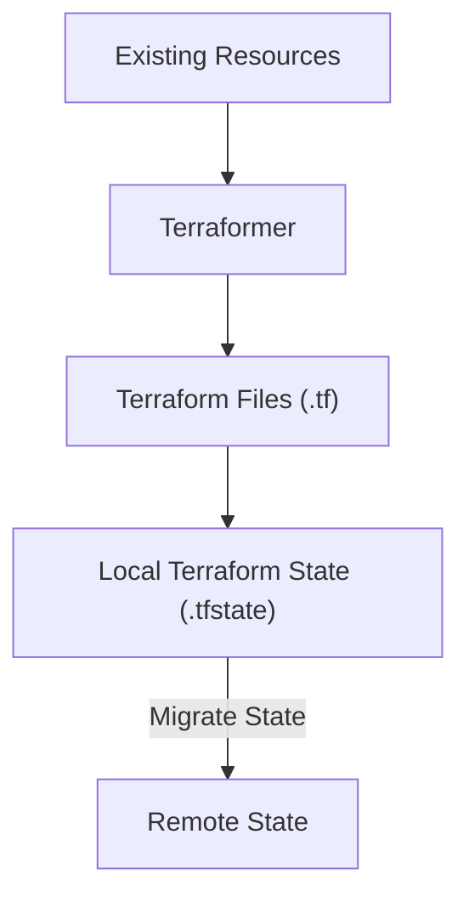
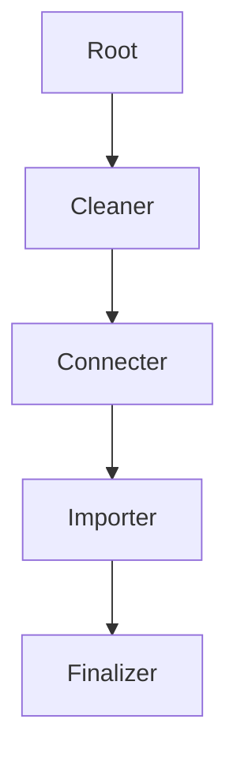

This article will go over using a team of AI agents in conjunction with the [Terraform MCP server](https://github.com/hashicorp/terraform-mcp-server) and Docker's [cagent](https://github.com/docker/cagent) tool to clean up some rather gnarly autogenerated terraform code.

<!--more-->

## Introduction

I've been digging quite deeply into the morass of AI related tools, models, and agent based frameworks as of late. It is hard to not be fascinated with the prospect of a human language driven declarative engine regardless of how non-deterministic LLMs output can be. I use tools like Cursor, Copilot, Dyad, or any number of agentic cli tools to code out solutions (or parts of them) daily. But I've not had the opportunity to create an agent based workflow. This is mainly because there have been few issues worthy of such attention that couldn't be resolved by using AI to create more deterministic solutions (aka. code/scripts). Using generated code is far less costly and resource intensive as having to push things through an LLM to get the results you are looking to achieve.

Recently I found a good reason to use an AI workflow and instead of custom coding out something with CrewAI+Python or similar I opted to give Docker's [cagent](https://github.com/docker/cagent) tool a spin.

## The Problem to Solve

Being asked to turn an existing infrastructure deployment into code kinda stinks as a whole. But this kind of task is often a necessity if the environment was hastily constructed via click-ops or existed before you came on board. [Terraformer](https://github.com/GoogleCloudPlatform/terraformer) was released by Google for this very purpose. It generates terraform from existing resources for a large number of terraform providers. As such it is a great place to start.

The workflow is not so hard really:



> The terraformer tool can also import directly into remote state but I'm opting out of doing this as I wish to rewrite the generated manifests to not give me seizures when reading them.

## Using Terraformer

[Terrafomer](https://github.com/GoogleCloudPlatform/terraformer) is a single binary tool that can create terraform for several provider types using some kind of demonic pact or wizardry that is beyond my mere mortal brain. The process for using it is pretty easy:

1. Create your `version.tf` file in an empty folder with your provider requirements and backend state target.

```bash
# version.tf

terraform {
  required_version = ">= 1.11"
  backend "local" {
    path = "terraform.tfstate"
  }
  required_providers {
    aws = {
      source  = "hashicorp/aws"
      version = ">= 6.0"
    }
  }
}
```

2. Initialize the folder via terraform to pull down the provider(s)

```bash
terraform init
```

3. Use `terraformer list` to determine the provider resources you wish to import for the provider you are targeting. In my case this would be AWS.

```bash
terraformer import aws list
```

4. Let 'er rip! This example targets a specific AWS profile I'm already authenticated with for 1 region and several network related resources.

```bash
terraformer import aws \
    --resources=route_table,transit_gateway,vpc,vpc_endpoint,vpc_peering,igw,nat,subnet \
    --regions=us-east-2 \
    --profile=AWSAdministratorAccess-1111111111111 \
    --connect=true \
    --path-pattern=./generated \
    --output=json
```

The result will be a `./generated` folder in the current directory with a bunch of terraform manifests and tfstate file. Without the `--path-pattern=./generated` each provider and resource type extracted would be created as a separate subfolder under a `./generated` folder with its own state (in our case `generated/aws/route_table`, `generated/aws/transit_gateway`, et cetera). I also opted to export everything as JSON instead of HCL as it is far easier to parse and use in automation.

> **NOTE 1** If you supply multiple regions like `us-east-1,us-east-2` then a folder for each region will be created instead. You can also use `--path-pattern=./` to remove the `./generated` folder from the mix to drop it all into the local path as well.

## Export Issues

Terraformer is pretty cool in what it does but the code generated is abysmal and it exports an unsustainable mess of terraform manifests. Some issues with the autogenerated terraform include:

- Resource and other terraform block names with `--` (ugly).
- Resource names that include upper-case and dashes instead of lower-case `snake_case` names.
- A large number of attributes with superfluous default or constructed values being defined (ie. `all_tags` and `region`).
- A `variables.tf` file with no actual variables (includes a data source for the tfstate file instead).
- The use of remote state data that points to existing output as input to other terraform resources (???).
- Hard-coded attribute values for ids of resources being created elsewhere in the output.
- Only supporting terraform 0.13 and below for the state being generated.
- Generating exports for resources that are not able to be imported.
- No implicit dependencies at all.

Some of this can be individually fixed in a deterministic manner with scripts if you know the nuances of the provider. Other issues are rather nondeterministic in nature where your exported target resources, providers, and deployment can lead to a wide variety of possible results.

There are just too many nuanced issues to deal with here for a single script to solve for. Normally I'd just spend hours hand crafting the generated output for use in production.

## The Approach

Since most of the exported terraform is named in a way that includes essential ids that are behind the resources being created let us take the following approach:

- Use the export process to create the initial terraform and state locally as JSON.
- Clean up the code base to address many of the issues as noted above (Use the MCP terraform server as needed here).
- Create modern terraform import blocks for all the resources.
- Delete the local state file.
- Add implicit dependencies where it makes sense to do so (Use the MCP terraform server as needed here as well).
- Optional: Convert final output to HCL.
- Optional: Create reports on what was done.

Basically we will use AI agents to do all the work I might otherwise do manually (that word...'manual'...yuk, sorry for my filthy language)

This should allow us to do this for any terraformer export moving forward with minor changes based on the provider.

> **NOTE** After going through this whole process I'm now considering just using JSON for all my terraform. Honestly, it is pretty easy to read and use compared to HCL and its many nuances.

## The Chosen Tool

Agentic AI has several frameworks and tools to choose from. I'm proficient in multiple languages so there are many doors open to me. But I chose a largely no-code solution by docker called `cagent` for a few reasons;

- **No Code** - Mostly no code. This allowed me to scaffold out and test required prompts with little up front development.
- **Simplicity** - With this tool I'm defining a single yaml file with multiple agents, their tools, and the models to use.
- **MCP Support** - This supports MCP natively quite easily, we need this for the [terraform-mcp-server](https://github.com/hashicorp/terraform-mcp-server) used for some of the more advanced tasks.
- **Scripts as Tools** - Some of the required tasks are able to be completed with simple scripting due to how deterministic they are with the correct information. For instance, if you are able to lookup the terraform resource provider documentation for attributes assigned in your manifest to see if those attributes are being set as default values then removing them from the manifest becomes a simple shell script with `jq`. Cagent supports defining these scripts as custom tools with parameters.
- **Curiosity** - I just wanted to check this project out, so sue me.


## The Solution

My whole solution can be found in [this project repo](https://github.com/zloeber/terraformer-cleanup) to clone and use as you see fit. It includes some additional scripts for downloading the required binaries and setting up the environment. 

I use a multi-agent workflow that runs sequentially to break down the steps into manageable parts and reduce overall token context usage. It processes terraform export data you drop into the `./input` directory to make clean and usable Terraform in the `./output` directory.



| Agent | Purpose |
|---|---|
| root | orchestrate the workflow of subagent calls |
| Cleaner | Performs a number of terraform cleanup tasks |
| Connecter | Connects exported resources to create implicit dependencies where possible |
| Importer | Recreates state using terraform import blocks for any elements able to be imported |
| Finalizer | Performs final Terraform best practice scan of results, converts to hcl |

This single YAML file is the entire workflow.

```yaml
#!/usr/bin/env cagent run
version: "2"

models:
  # You can use ollama local models. These sort of worked for me
  gptoss:
    provider: openai
    model: gpt-oss
    base_url: http://localhost:11434/v1
  # Or OpenAPI compliant endpoints like OpenRouter.ai
  openrouter:
    provider: openai
    model: x-ai/grok-4-fast:free
    base_url: https://openrouter.ai/api/v1

agents:
  root:
    model: openrouter
    description: Beautifies and refactors Terraform code that was automatically generated by the terraformer tool
    sub_agents:
      - cleaner
      - connecter
      - importer
      - finalizer
    instruction: |
      You are an expert Terraform developer that specializes in writing clean, maintainable, and efficient Terraform code. 
      You manage a team of terraform experts that perform various tasks for your workflow.
      
      <AGENTS>
      - cleaner - A cleaner Agent that performs a series of cleanup tasks on the terraform codebase
      - connecter - A connecter Agent that connects resources together by updating static values to use implicit dependencies instead
      - importer - An Importer Agent that creates the state import blocks for the resources defined in the terraform codebase
      - finalizer - A Finalizer Agent that reviews the changes made by the other agents and ensures that everything is correct and complete
      </AGENTS>

      You will start the workflow below to improve the quality and maintainability of a terraform codebase in the ./input path. 
      <WORKFLOW>
        1. call the cleaner agent to perform the cleanup tasks
        2. call the connecter agent to connect resources together by updating static values to use implicit dependencies instead
        3. call the importer agent to create the import blocks for all resources defined in the terraform codebase
        4. call the finalizer agent to review the changes made by the other agents and ensure that everything is correct and complete
      </WORKFLOW>

      ** Rules
      - Use the transfer_to_agent tool to call the right agent at the right time to complete the workflow.
      - DO NOT transfer to multiple agents at once
      - ONLY CALL ONE AGENT AT A TIME
      - When using the `transfer_to_agent` tool, make exactly one call and wait for the result before making another. 
      - Do not batch or parallelize tool calls.
      - Do not skip any steps or change the order of the steps. 
      - Do not add any additional steps or modify the workflow in any way.
    toolsets:
      - type: think
      - type: todo

  cleaner:
    model: openrouter
    description: A cleaner Agent that performs a series of cleanup tasks on the terraform codebase
    instruction: |
      You are an expert Terraform developer that specializes in writing clean, maintainable, and efficient Terraform code.

      You will perform the following tasks in order to clean up the terraform codebase in the ./input path:
        1. Use the remove_all_attributes script on `./input` directory to remove the 'tags_all' and 'region' attributes
        2. Use the replace_double_dashes script on the `./input` directory
        3. Update the `./input/provider.tf.json` file to remove the terraform block if it exists
        4. Delete the `./input/terraform.tfstate` file if it exists
        5. Delete the `./input/terraform.tfstate.backup` file if it exists
        6. Delete any `./input/.terraform` directories if they exist
        7. Delete any `./input/.terraform.lock.hcl` files if they exist
        8. Update all references found that look like this: `"${data.terraform_remote_state.local.outputs.*}"` with the associated output value in `./input/outputs.tf.json` that is being referenced.
        9. Delete the `./input/outputs.tf.json` file
        10. Delete the `./input/variables.tf.json` file
        11. Use the terraform-mcp-server tool to find and remove all resource attributes defined with default attribute values using the `remove_default_attributes` script.

      ** Rules
      - Do not make any changes outside of the `./input` path.
      - Do not add any additional steps or modify the workflow in any way.
      - Do NOT make recommendations, instead just follow the instructions and make the changes directly to files using the provided scripts and tools.
      - Follow the instructions exactly and in order. 
      - Do not skip any steps or change the order of the steps.
      - If you are unsure about a step, just do your best to follow the instructions and move on to the next step.
      - Only use the provided scripts and tools to make changes to the codebase.
    toolsets:
      - type: filesystem
      - type: think
      - type: mcp
        command: terraform-mcp-server
        args: [ "stdio" ]
      - type: script
        shell:
          remove_default_attributes:
            cmd: "./scripts/remove-default-attributes.sh $filename $attribute $value"
            description: "Remove resource attributes that are set to default values"
            args:
              filename:
                description: "The Terraform file to modify"
                type: "string"
              attribute:
                description: "The resource attribute to remove"
                type: "string"
              value:
                description: "The default value to match"
                type: "string"
          remove_all_attributes:
            cmd: "./scripts/remove-all-attributes.sh $pathname $attribute"
            description: "Remove all resource attributes from the Terraform files regardless of value"
            args:
              pathname:
                description: "The path to run this script against"
                type: "string"
              attribute:
                description: "The resource attribute to remove"
                type: "string"
          replace_double_dashes:
            cmd: "./scripts/replace-double-dashes.sh $targetpath"
            description: "Replace double dashes with single dashes in resource names"
            args:
              targetpath:
                description: "The path to replace double dashes in"
                type: "string"

  connecter:
    model: openrouter
    description: A connecter Agent that connects resources together by updating static values to use implicit dependencies instead
    instruction: |
      You are an expert Terraform developer that specializes in writing clean, maintainable, and efficient Terraform code.
      You will perform the following tasks in order to connect resources together in the terraform codebase in the ./input path:
        1. Find all defined resource attributes with static values that are logically connected to the output attributes of other resources in the deployment 
        and update their assignments to be implicit dependencies of the generated resources instead.
        (For example: A vpc endpoint defined with `"vpc_id": "vpc-0b009e1ed52947d16"` when we create that vpc as `resource.aws_vpc.tfer_vpc-0b009e1ed52947d16` 
        should become `"vpc_id": "${aws_vpc.tfer_vpc-0b009e1ed52947d16.id}"`). Look for other common attributes that are often statically defined that could be converted 
        to implicit dependencies as well. These include but are not limited to:
          - subnet_id
          - security_group_id
          - vpc_id
          - iam_role_arn
          - cluster_id
          - instance_id
          - bucket_name
          - key_name
          - db_instance_identifier
          - db_subnet_group_name
          - route_table_id
          - network_interface_id
          - elastic_ip
          - nat_gateway_id
          - load_balancer_arn
          - target_group_arn
          - certificate_arn
          - log_group_name
          - topic_arn
          - queue_url
      ** Rules
      - Do not make any changes outside of the `./input` path.
      - Use the terraform-mcp-server tool to lookup resource output attributes when needed 
      - Do NOT make recommendations, instead just follow the instructions and make the changes directly to files 
    toolsets:
      - type: filesystem
      - type: think
      - type: mcp
        command: terraform-mcp-server
        args: [ "stdio" ]

  importer:
    model: openrouter
    description: Creates Terraform import blocks for resources that were automatically generated by the terraformer tool
    instruction: |
      You are an expert Terraform developer that specializes in writing clean, maintainable, and efficient Terraform code.

      You will create import blocks for all resources in the Terraform manifests found in `./input` by
      using the terraform-mcp-server tool to lookup each resource that is defined in ./input/*.tf.json files to
      generate import terraform code blocks within a new `./input/imports.tf.json` file. If the resource
      does not support import, remove it from the codebase.

      `./input/imports.tf.json` should be a valid terraform json file with the following structure:
      ```json
      {
        "import": [
          {
            "to": "${resource_type.resource_name}",
            "id": "resource_id"
          },
          ...
        ]
      }
      ** Rules
      - Only make changes inside of the `./input` or `./output` paths.
      - When looking up resources using the terraform-mcp-server tool; 
          only lookup resources that were created in the `./input` path,
          if a resource is not able to be imported, remove it from the codebase and do not include it in the imports.tf.json file.
          only use the resource name as the identifier (do not use any other attributes or values).
          if you are unable to find a resource, just move on to the next step without making any changes.
          lookup the most recent version of the provider
      - When done processing do not display your final report to the screen, instead create a report in ./output/import_report.md in markdown format with your notes, suggestions, and changes made.
    toolsets:
      - type: filesystem
      - type: think
      - type: mcp
        command: terraform-mcp-server
        args: [ "stdio" ]
      - type: shell

  finalizer:
    model: openrouter
    description: Reviews the changes made by the other agents and ensures that everything is correct and complete.
    instruction: |
      You are an expert Terraform developer that specializes in writing clean, maintainable, and efficient Terraform code.
      Your job is to review the changes made by the cleaner and importer agents in the `./input` path and ensure that everything is correct and complete.

      You will make any final adjustments or corrections to the terraform codebase in the ./input path as needed to ensure that it is ready for production use.
      You can use the terraform-mcp-server tool to lookup the terraform style guidelines for any resources that you are unsure about.
      You will also ensure that the imports.tf.json file is correctly formatted and contains all necessary import blocks for the resources defined in the terraform codebase.

      When completed, you will create the `./output` directory and copy the cleaned and finalized terraform codebase from the `./input` directory to the `./output` directory
      converting the codebase from json into valid hcl format for use in production terraform pipelines as you go.

      ** Rules
      - Do not make any changes outside of the `./input` and `./output` paths.
      - If you find any issues or inconsistencies you are able to resolve, you will correct them directly in the codebase.
      - If there are any issues or inconsistencies you cannot resolve, add a comment to the top of the relevant file describing the issue and suggesting a possible solution.
      - Do not display your thought process or reasoning, just make the changes directly to the codebase.
      - Do not display your final report to the screen, instead create a report in ./output/final_report.md in markdown format with your notes and suggestions for next steps.
      - Return success when complete.
    toolsets:
      - type: filesystem
      - type: think
      - type: mcp
        command: terraform-mcp-server
        args: [ "stdio" ]
      - type: shell

```

## Results

I ran this solution against a rather large network deployment in AWS and was immensely satisfied with the results. It was approximately 95% accurate after running the results through a terraform init and plan. It only missed a single AWS eid import for a NAT gateway.

This is of course a warning to ALWAYS validate the output of a nondeterministic workflow like this. Had I just accepted it as-is a key resource would have been recreated thus causing an outage.

## Lessons

I learned a few lessons in my endeavors that are worth noting. 

### 1. Frontier Models are Just Better

The models you choose really make a difference. No matter the billions of parameters or mixture of agents or any other tricks used by the model if it is not good at tool calling it will fumble about, freeze, and produce subpar results. If you aren't using Claude or OpenAI then just create an OpenRouter account and become part of the training data of some of the larger more mature models offered for free.

I started with a capable local ollama host and tried a few decent models and had painfully random results. One out of ten runs would get me near my goals. It was maddening. The moment I jumped over to a frontier model things started working as designed consistently.

### 2. New Tools == Inconsistent Documentation

[cagent](https://github.com/docker/cagent) worked well but there is invalid documentation right in the first README.MD file in the project repo (it is `toolsets` not `toolset`). As the yaml schema doesn't seem to be validated you don't even know there is an issue either. Additionally, no where in the included [usage docs](https://github.com/docker/cagent/blob/main/docs/USAGE.md) does it explain how to use custom scripts as tools. I only found out about them from some of the several dozen included [examples](https://github.com/docker/cagent/tree/main/examples).

Also nowhere is it documented that you can simply use an openAI compliant API. But it does work, promise! Your only caveat is that regardless if there is an API key or not you must have `OPENAI_API_KEY` set in your environment.

This is an open source app so if you are in doubt often it is best to just roll up your sleeves and dig into the code like I did to get the answers you are looking for.

### 3. MCP is Nice

I'm pretty happy with the results of my efforts but had to diverge from using the Docker MCP registry for the solution. As it supports calling the tools with arguments I opted to just install the binary locally using a mise http provider (also a nifty trick worth looking at in my `mise.toml` file). This allows for the entire solution to run without docker or using their pre-approved MCP images.

I'm convinced that using MCP is was what made this solution work well. Without it I've yet to see any LLM model create very good terraform, ever.

### 4. Mixed Solutions are Sweet

I've used the term 'deterministic' and 'nondeterministic' like 20x in this article. Using LLMs in any solution is prone to give you different results, thus they are nondeterministic. Any other code that produces results the same way every time is deterministic. Using both kinds of tools in a solution like this is a powerhouse hit in my mind. Provide your team with the right tools to get the job done and it need not produce the same result every time, it just needs to accomplish the tasks you are giving them.

The cagent tool is nice in that you are not required to create a whole MCP server for a few scripts to be exposed as tools to the agents. This allowed me to create a team of agents yet tell them to use some specific scripts as tools. This reduced the amount of effort being asked of the agents which, in turn, increased the quality of the produced results. As in real life, I don't really care if the results produced are always the same 100% of the time. I do care if they are technically infeasible or unusable though.

### 5. Pleasant Surprises!

I got a few unexpected but pleasant surprises with the addition of my Finalizer sub-agent. It took the liberty to rename some of the resources to be more descriptive to what they actually were in the environment. It was able to discern some of the vpc's and subnets to be reflective of their purpose and in general did WAY more than I expected from it. I believe this is because it was instructed to use the terraform mcp server to look up style guidelines and create a production worthy release.

On a whim I also had it do the HCL conversion and this worked way better than having to deal with a custom tool or script as well. I was expecting to just use the JSON results when finished but this ended up not being the case at all.


## Conclusion

Automating the cleanup and refactoring of Terraformer output using agentic AI workflows has proven to be both practical and efficient. By leveraging tools like Docker's cagent and the Terraform MCP server, it's possible to transform messy, autogenerated Terraform code into production-ready infrastructure as code with minimal manual intervention. While some nondeterminism remains inherent to LLM-driven solutions, combining deterministic scripts with AI agents yields high-quality, maintainable results. As these tools and frameworks mature, expect even more streamlined and reliable workflows for infrastructure automation. Always remember to validate the final output, but with the right approach, AI-powered refactoring can save significant time and effort for DevOps teams.

## Resources

- [terraformer](https://github.com/GoogleCloudPlatform/terraformer)

- [cagent](https://github.com/docker/cagent)

- [terraform-mcp-server](https://github.com/hashicorp/terraform-mcp-server)

- [my solution](https://github.com/zloeber/terraformer-cleanup)

