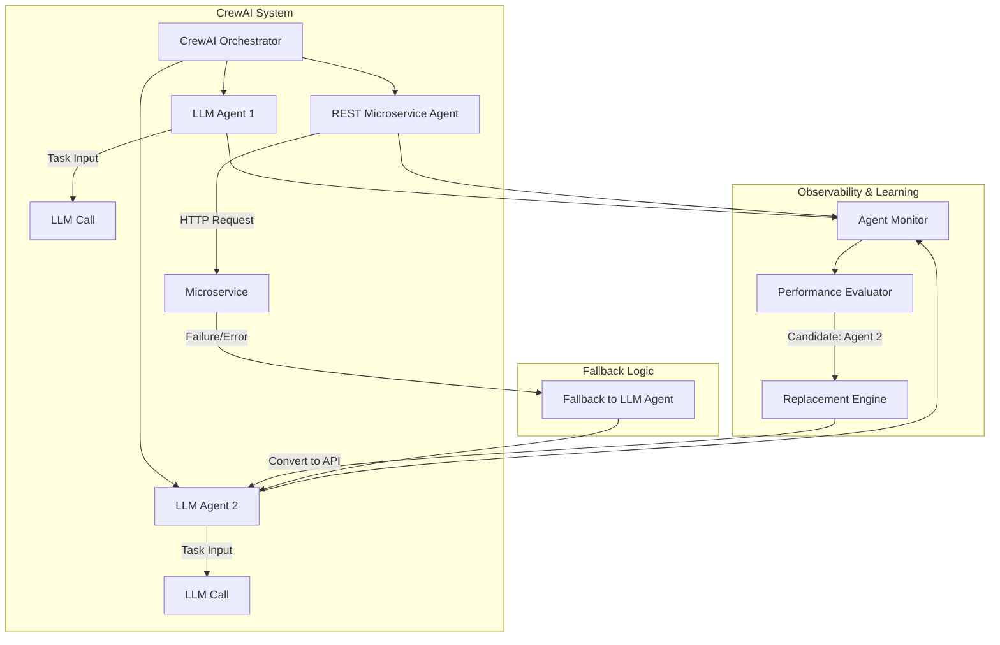

There’s something mesmerizing about watching a swarm of agents work together, autonomously solving problems, learning from each other, and adapting over time. But let me ask you this: what happens when the same agent keeps solving the same problem the same way, over and over again? Do we really need the power of a Large Language Model (LLM) for that?

<!--more-->

## Introduction

This is the fundamental realization behind a self-improving agentic system that starts with LLM-driven reasoning but evolves into something far more efficient: a lean, hybrid system of smart orchestration and deterministic microservices. It’s cost-effective. It’s scalable. And it's the next natural evolution of agent-based architecture.

## The Premise: Agent Evolution by Observation

At the start of any complex task, agents need flexibility. They need to reason. LLMs are perfect for this: they can assess fuzzy goals, decompose tasks, and adapt their approach. But not every task needs this level of cognitive power forever.

Over time, patterns emerge. Some subtasks become stable. Their inputs are consistent. Their outputs are predictable. And most importantly, they're repeatable. That’s your cue.

If you’re still throwing tokens and latency at an LLM for a decision tree or a date reformatter, you’re burning cash and compute.

## The Orchestration Engine

Enter CrewAI. This lightweight agent orchestration framework gives us modular, goal-driven agent teams that can be composed of:

- LLM-based Agents (for flexibility and reasoning)
- Tool-based Agents (Python, API wrappers, DB connectors)

It's an ideal environment for building a self-improving system. Every agent is observable. Every decision, traceable.

> **NOTE** Or autogen, or `__<your preferred agent orchestration system>__`. I'm just using CrewAI as I've been diving into it. Honestly, the orchestrator likely doesn't matter as much.

## Building a Self-Improving Agentic System

Here’s how the architecture works:

1. Agent Orchestration: A CrewAI crew manages a group of agents working on a complex task.
2. Monitoring: An Agent Monitor observes all interactions—inputs, outputs, execution time, accuracy.
3. Evaluation: A Performance Evaluator detects when an LLM agent’s behavior becomes deterministic.
4. Microservice Replacement: When confidence is high, the LLM agent is replaced with a RESTful microservice.
5. Fallback: If the microservice fails or performs worse, the system falls back to the original LLM.

This system can literally evolve from a fully LLM-powered swarm into a streamlined microservice architecture, all while maintaining the ability to reason and adapt when needed.

## A Look Under the Hood

Here's the Mermaid diagram representing the high-level architecture I'm proposing. Certainly there are cleverer folk than I that can construct a more compelling design but this generally covers the bases.



CrewAI Agent: Performance Evaluator Agent Definition

Here’s how you might define the CrewAI agent responsible for evaluating conversion candidates:

```python
from crewai import Agent, Task
from tools import AgentMetricsTool, HistoricalDataTool

performance_evaluator = Agent(
    name="Performance Evaluator",
    role="Identifies LLM agents suitable for microservice conversion",
    goal="Monitor agent performance and identify deterministic behavior",
    backstory="You are a metrics-obsessed evaluation agent who tracks execution trends and identifies agents that show deterministic, low-variance behavior.",
    tools=[AgentMetricsTool(), HistoricalDataTool()],
    verbose=True
)

evaluate_task = Task(
    description="Analyze the behavior logs of all LLM agents and determine which exhibit repeatable, deterministic patterns suitable for conversion to a RESTful microservice.",
    expected_output="A list of agent IDs along with justification for conversion recommendation, including recent task types, inputs, outputs, and statistical metrics.",
    agent=performance_evaluator
)
```

Tools:

**AgentMetricsTool**: Queries performance metrics like latency, success rate, and output variance.
**HistoricalDataTool**: Fetches execution logs and traces for statistical analysis.

This agent is only responsible for detection. Once a candidate is confirmed, another agent (e.g., Conversion Engineer) can handle the transformation into a microservice.

## Why This Matters

1. Cost Optimization

LLMs are powerful, but they’re expensive—especially at scale. When 80% of your agent traffic is going toward repetitive deterministic tasks, converting those into microservices can reduce cost dramatically.

2. Latency Reduction

APIs are faster than language models. That means better user experience, tighter feedback loops, and snappier execution.

3. Scalable Growth

Agentic systems grow quickly. If every new agent adds exponential LLM cost, you're bottlenecked. But if agents can evolve into optimized services? Now you have a path to exponential scale.


## What Tasks are Best Suited for Microservice Conversion?

Not every task deserves a microservice. But some are almost begging for it. Here’s how to tell the difference:

✅ **Ideal for Microservice Replacement**

- **Deterministic Logic**: Tasks with clear rules (e.g., currency conversion, date formatting, validation).
- **High-Frequency, Low-Variance**: Frequently invoked tasks with stable input/output patterns.
- **Well-Scoped Subtasks**: Self-contained functions (e.g., generating summaries, transforming structured data).
- **Security-Sensitive Tasks**: Operations that need to run locally or within audited infrastructure.

🚫 **Better Left to LLMs (For Now)**

- **Fuzzy Reasoning**: Tasks involving ambiguity, creativity, or subjective judgment.
- **Open-Ended Questioning**: When input or output types vary widely.
- **Human-Like Conversation**: Chatbots, therapeutic agents, negotiators.
- **Emergent Strategy**: Agents deciding what to do, not just how to do it.

Understanding this divide is critical. It helps ensure that what you convert enhances your system, rather than limiting it.

## A Call to Build

The industry is obsessed with the next model drop. Bigger, smarter, faster. But maybe what we need isn’t a bigger brain—it's a better memory. A better strategy. A system that grows smarter by evolving, not just prompting.

If you're building multi-agent systems today, start capturing the telemetry. Start noticing the patterns. And start planning for a future where your agents don't just learn—they graduate.

The next era of intelligent systems won't be just LLMs talking to each other. It'll be hybrid intelligence built on adaptability, observation, and intentional optimization.

Let's build it.
