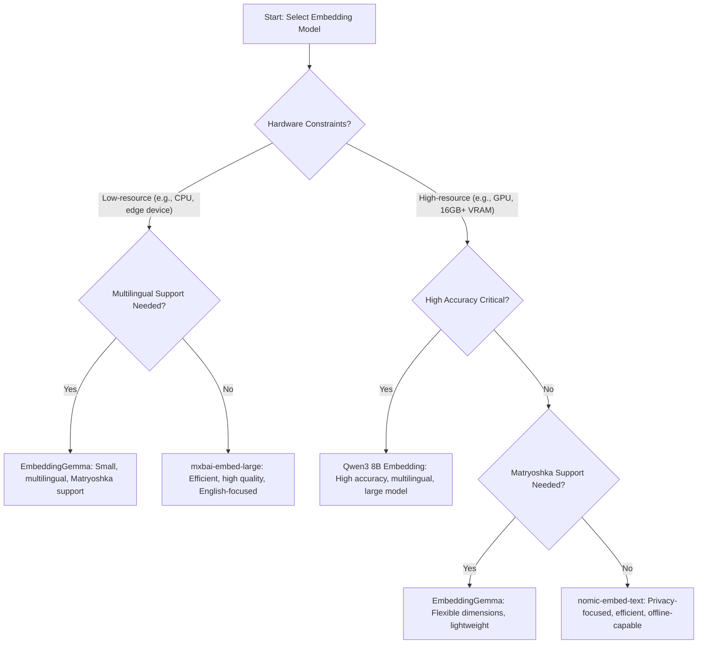

I've got a tendency to take tools and frameworks in IT and immediately push them to their limits and beyond. Sadly, this often lands me into the trough of disillusionment quite quickly when exploring any new technology. On the flip side, it is through this process I often learn some great lessons. This article will cover lessoned learned as it pertains to AI in an effort to help shortcut some of those that are starting to dive further into this incredible new world we are entering with AI.

<!--more-->

## Context Management Is Key

Context is the length of your prompt in its entirety. This includes any conversation history, custom instructions, additional rules, available tool instructions, RAG results, and verbalized reasoning output. This adds up quickly in smaller local models and needs to be factored into your overall context management strategy. One decent strategy is to look into multi-agent frameworks where each agent has its own unit of context. It is quite easy to cram all your needs into a single agent because you as a human could do a single workflow from end to end. But if you give it just a bit more thought and logically break things out into sub units of work for various sub-agents it will be less likely you run into context limit issues.

> **NOTE** Is your agent reading in several dozen files from the filesystem? This is one area where you can easily blow up your context if not thought out carefully!

## Sometimes a Dumber AI is Better

Many LLM models include reasoning or thinking modes of operation that you may reflexively want to use. Why wouldn't you want your LLM to be a bit more thoughtful in how it responds right? I can give you a few reasons you may want to dial back the deep thoughts on these things. Firstly, it can cause token bloat which directly equates to additional cost and latency. Secondly, not all LLMs separate out the thoughts from the output the same. Ollama will inline the thoughts with standard responses in tags like `<thought></thought>`. This can be a bit of a bummer to deal with in some applications. While it can be facinating to read how they are thinking through a process it can really pollute output if not handled properly. Third, I've experienced that including thinking in my requests sometimes led to worse results overall. This is only my anecdotal observations but I believe some models maybe overthink some simpler tasks or in the case of multi-agent interactions, simply confuse agents reading the reasoning output responses of other sub-agents.

If you are employing a multi-agent workflow I'd consider only allowing for the orchestrator/master agents to process with additional thinking models. Or if that is not suitable, just enable thinking selectively and just make a bunch of purpose driven sub-agents that can be a bit dumber.

## MCP Is Sweet But Fickle

I've run into several issues with MCP tools that were driving me crazy. There are some great MCP inspection tools but in a pinch you can also simply ask the LLM to give you a report of available tools that have been exposed to it. Here is a [cagent](https://github.com/docker/cagent) definition I put together that does this for a local ollama model I was testing out with some tools I was tinkering with on my local workstation.

```yaml
#!/usr/bin/env cagent run
version: "2"

models:
  thismodel:
    provider: openai
    model: gpt-oss
    base_url: http://localhost:11434/v1
    api_key: ollama
    max_tokens: 16000
    temperature: 0.1

agents:
  root:
    model: thismodel
    add_date: true
    description: Creates documentation on available tools for this agent
    instruction: |
      You are evaluating the functionality of various tools available to you as an AI agent.
      Your goal is to generate a comprehensive report on the functionality of any tools that you can use to assist you in your tasks.
      You will use the filesystem tool to read and write your final report in markdown format as a .md file with a name like tool-report-<date>.md.
      No other tools are to be used by you directly but you can query the list of tools available to you.
      You will instead generate a list of all the tools you can use and their functionality.
    toolsets:
      - type: filesystem
      - type: think
      - type: memory
      - type: mcp
        command: terraform-mcp-server
        args: [ "stdio" ]
      - type: mcp
        command: npx
        args: [ "-y", "mcp-searxng" ]
        env:
          SEARXNG_URL: "http://localhost:8080"
```

## Model Selection Is Hard

There are just so many models out there to choose from. It would be easy to think that local models are good enough but honestly, no they are not. Aside from their smaller context length there is no standard way to really even look them up. This makes finding effective context length and max token counts a chore at best. Ollama has their own online catalog (api for it is forthcoming I've read) and there are some other minor lifelines such as [this gem](https://github.com/BerriAI/litellm/blob/main/litellm/model_prices_and_context_window_backup.json) buried in the LiteLLM repo. This is just the hard details of the models, not their numerous scores, capabilities, and more. OpenRouter.ai has [an api endpoint](https://openrouter.ai/docs/api-reference/list-available-models) that makes searching for some of this a bit easier for models it supports.

This is all only for language models by the way. Additional servers and consideration for their use come to play for image, video, or audio generation. So if you are planning on doing something multi-model then the efforts begin to stack up rather quickly.

This all said, often simply choosing a decent frontier model is the fastest and easiest way to go. Grok for more recent research is nice, Claude for coding is a good bet, OpenAI if you want to fit in with the broadest ecosystem of tools and community support. 

## Don't Forget Embedding Models

Let's not forget both RAG and (most) memory related tasks require [embedding models](https://ollama.com/blog/embedding-models). In (most) cases this will require some vector database which means you will need to encode your data into vectors via an embedding model. These are smaller and purpose driven to convert your language (or code AST blocks, or `<some other esoteric data>`) into embedded similarity vectors. If you are doing local RAG for privacy then you will need a local embedding model and vector database to target. I've been using ollama and one of a few models it offers for embedding with qdrant as my local vector store as it has a nice little UI I can use to further explore vectorized data. Towards the end of this article I'll include a docker compose that will bring up this vector database quite easily.

If you are embedding RAG data you will still often need to get it into an embedding model friendly format. I've taken a liking to [marker](https://github.com/datalab-to/marker) for this task to process PDFs and other document formats. Once installed you can process a single document against a local ollama model to create a markdown file quite easily `marker_single --llm_service=marker.services.ollama.OllamaService --ollama_base_url=http://localhost:11434 --ollama_model=gpt-oss ./some.pdf`. There are so many options for marker that I think the author must be partially insane (in a good way, I dig it) so check it out if you get a few free cycles. The project is impressive in its scope.

Back to embedding models. There are several local ones you can choose from. Here are a few of the most popular open source ones as generated via AI.

| Model Name         | Dimensions        | Max Input Tokens | Perf. (MTEB/Accuracy Score)   | Multilingual Support |
| ------------------ | ----------------- | ---------------- | ----------------------------- | -------------------- |
| mistral-embed      | 1024              | 8000             | 77.8% (highest in benchmarks) | Yes                  |
| nomic-embed-text   | 1024              | 8192             | High (state-of-the-art)       | N/A                  |
| mxbai-embed-large  | 1024              | N/A              | High (state-of-the-art)       | N/A                  |
| EmbeddingGemma     | N/A (small model) | N/A              | High (best under 500M params) | Yes (100+ languages) |
| Qwen3 8B Embedding | N/A (8B params)   | N/A              | 70.58 (top in multilingual)   | Yes                  |

Some additional notes on each model as well:

| Model Name         |Notes                                                                     |
| ------------------ |------------------------------------------------------------------------- |
| mistral-embed      |Strong semantic understanding; open weights available on Hugging Face.    |
| nomic-embed-text   |Offline-capable via Ollama; privacy-focused for local deployments.        |
| mxbai-embed-large  |Efficient open-source option; available via Ollama or Hugging Face.       |
| EmbeddingGemma     |Mobile-ready; Matryoshka learning; ideal for edge devices or fine-tuning. |
| Qwen3 8B Embedding |Excels in diverse topics; Apache 2.0 license for customization.           |

Here is a simple diagram of choices to make for selecting one of the free embedding models for your own projects. 



> **Matryoshka Support?** This was new to me when writing this article. A model that supports this might embed a chunk of data with 1024k dimensions to query for similarity against but be trained to surface the most important ones into the top 256 or 512 dimensions. This allows for the embeddings to capture most of the semantic meaning with a slight loss of precision if truncated compared to the full vector. Pretty nifty as it allows single models to generate multi-dimension embeddings. This is inspired by the concept of Matryoshka dolls, where smaller dolls nest within larger ones, and is formally known as Matryoshka Representation Learning (MRL).

## Web Search Without Limits/Keys

When you start to develop AI agents to do things one of the first activities will be to search the web for content then scrape it. This seems like a very innocuous task as it is something you might do every day without thought. But doing so automatically as an agent often requires some form of API key with an outside service (like Serper or any number of a dozen others) or through a free but highly rate limited target such as duckduckgo.

With MCP and a local [SearXNG](https://github.com/searxng/searxng) instance you can get around this snafu fairly easily. It is a local running search aggregator. Remember dogpile.com? SearXNG is kinda like that but locally hosted and more expansive in scope. You need only expose it to your agents using a local MCP server and they can search and scrape the web freely. I've included it in this docker compose file for your convenience (along with the valkey caching integration). This compose file is self-contained. All configuration can be done via the config blocks at the bottom.

```yaml
# Exposes the following services:
# - http://localhost:6333/dashboard - qdrant (ui)
# - http://localhost:8080 - searxng (ui)
# - valkey (internal, for searxng)

services:
  valkey:
    container_name: valkey
    image: docker.io/valkey/valkey:8-alpine
    command: valkey-server --save 30 1 --loglevel warning
    restart: unless-stopped
    volumes:
      - valkey-data2:/data
    logging:
      driver: "json-file"
      options:
        max-size: "1m"
        max-file: "1"
    healthcheck:
      test: ["CMD", "valkey-cli", "ping"]
      interval: 10s
      timeout: 5s
      retries: 5

  searxng:
    container_name: searxng
    image: docker.io/searxng/searxng:latest
    restart: unless-stopped
    ports:
      - "127.0.0.1:8080:8080"
    volumes:
      - searxng-data:/var/cache/searxng:rw
    configs:
      - source: searxng_limiter_config
        target: /etc/searxng/limiter.toml
      - source: searxng_config
        target: /etc/searxng/settings.yml
    environment:
      - SEARXNG_BASE_URL=https://${SEARXNG_HOSTNAME:-localhost}/
    logging:
      driver: "json-file"
      options:
        max-size: "1m"
        max-file: "1"
    depends_on:
      valkey:
        condition: service_healthy
    healthcheck:
      test: ["CMD", "wget", "--no-verbose", "--tries=1", "--spider", "http://localhost:8080/"]
      interval: 30s
      timeout: 10s
      retries: 5
      start_period: 30s

  qdrant:
    image: qdrant/qdrant:latest
    restart: unless-stopped
    container_name: qdrant
    ports:
      - 6333:6333
      - 6334:6334
    expose:
      - 6333
      - 6334
      - 6335
    configs:
      - source: qdrant_config
        target: /qdrant/config/production.yaml
    volumes:
      - ./data/qdrant:/qdrant/storage
    healthcheck:
      test: ["CMD", "bash", "-c", "exec 3<>/dev/tcp/127.0.0.1/6333 && echo -e 'GET /readyz HTTP/1.1\\r\\nHost: localhost\\r\\nConnection: close\\r\\n\\r\\n' >&3 && grep -q 'HTTP/1.1 200' <&3"]

volumes:
  valkey-data2:
  searxng-data:

configs:
  searxng_limiter_config:
    content: |
      # This configuration file updates the default configuration file
      # See https://github.com/searxng/searxng/blob/master/searx/limiter.toml

      [botdetection.ip_limit]
      # activate advanced bot protection
      # enable this when running the instance for a public usage on the internet
      link_token = false
  searxng_config:
    content: |
      # see https://docs.searxng.org/admin/settings/settings.html#settings-use-default-settings
      use_default_settings: true
        # engines:
        #   keep_only:
        #     - google
        #     - duckduckgo
      server:
        # base_url is defined in the SEARXNG_BASE_URL environment variable, see .env and docker-compose.yml
        secret_key: "some_secret_key123"  # change this!
        limiter: false  # enable this when running the instance for a public usage on the internet
        image_proxy: true
      search:
        formats:
          - html
          - csv
          - rss
          - json
      valkey:
        url: valkey://valkey:6379/0
  qdrant_config:
    content: |
      log_level: INFO
```

You can see my prior cagent yaml example to see an mcp server that can use this local instance.

```yaml
...
      - type: mcp
        command: npx
        args: [ "-y", "mcp-searxng" ]
        env:
          SEARXNG_URL: "http://localhost:8080"
...
```

## Conclusion

AI development is a rapidly evolving field, and the lessons learned along the way can save you time, frustration, and resources. By understanding the nuances of context management, model selection, embedding strategies, and practical tooling, you can build more robust and efficient AI workflows. Embrace experimentation, but also leverage the growing ecosystem of open-source tools and best practices. As the landscape continues to shift, staying curious and adaptable will be your greatest assets. Happy building!