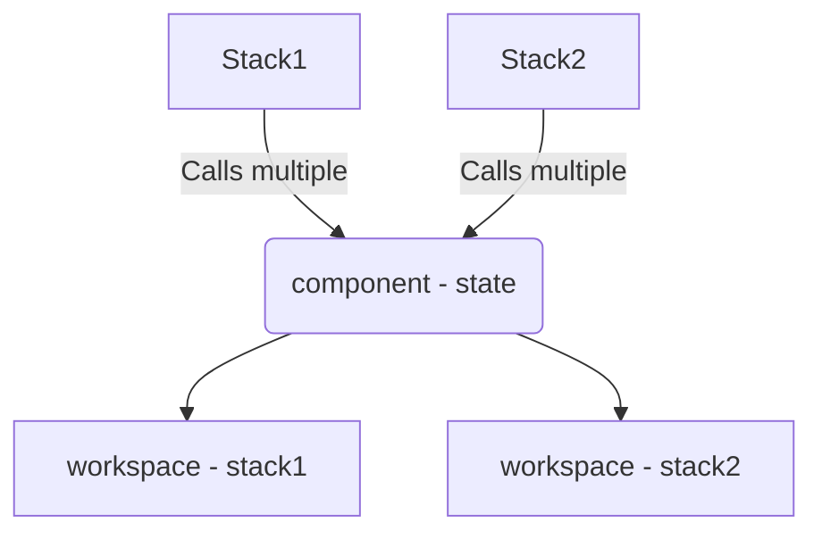

Terraform is great until you have to deal with state. As large state inherently will not scale you find that the more things grow the more state that needs to be managed and connected and otherwise understood. 

Atmos is a tool for this and so much more. This article will build on my prior terraform to opentofu encrypted local state example to introduce the use of atmos for deployment of my multi-state project. This time I'll change over to the [`tofu-encrypted-atmos` branch](https://github.com/zloeber/tofu-exploration/tree/tofu-encrypted-atmos).

---

## What is Atmos?

[Atmos](https://atmos.tools/) is an opinionated infrastructure deployment tool from the great minds at [CloudPosse](https://cloudposse.com/). This team has a long history of releasing incredible Terraform modules and being deeply involved within the DevOps community. Eric has been running a weekly podcast/open office hours to talk all things DevOps for years now that I highly recommend people check out.

Anyway, the point is that makers of this tool are really really good at flinging Terraform and have strong opinions on how to automate it. Atmos is the culmination of experienced gained by being in the trenches with infrastructure automation. It might be comparable to [terragrunt](https://terragrunt.gruntwork.io/), Terraform stacks ([public beta](https://developer.hashicorp.com/terraform/language/stacks)), [Cisco's stacks](https://github.com/cisco-open/stacks), or even the [cdktf](https://developer.hashicorp.com/terraform/cdktf) which also has a stack concept.

## Understanding

 As always, there is a short learning curve to grok the atmos view of the world. I'll distill it down as best I can (please read more in their docs for a deeper dive). Let us start by level setting on vocabulary as it will help shortcut understanding of how to look at the atmos project structure layout. Here are some terraform terms and their Atmos equivalent.

| Terraform | Atmos | Description |
| --- | --- | --- |
| root module | component | State lives here |
| multiple root modules | stack | Multiple components grouped together |
| group of available root modules | component library | Just a bunch of components in a logical group |
| sub-module | sub-module | same as they ever were |

**TIP** A stack is effectively an environment.

Atmos makes clever use of terraform workspaces for each component defined in a stack. This is pretty efficient and an entirely seamless use of terraform workspaces that looks a little like this:

In this next diagram we'd have one state element for the localhost, cluster1, and cluster2 components in the dev workspace. We'd also have 1 state element in the baremetal  and cluster1 components for the prod workspace. This gives us 5 total state targets when completely deployed.

![[atmos-stacks.png]]

> **NOTE** The component library concept allow for and additional vector to parameterize your deployments and allows for dependency mapping between disparate terraform states.

## Adopting Atmos

In order to accommodate for atmos I had to allow for some previously git ignored paths and trust that my openTofu encrypted state process was working properly.

> **NOTE** I effectively relinquished the state management to atmos for local state files. I did end up adding a quick validation task unit test the state is encrypted for each deployment. `task test:state`

My root modules (now 'components') I had to remove all traces of the local backend configuration as atmos overwrites it otherwise (causing an endless loop of changed backend state migration approval prompts). The documentation for atmos goes over a slew of different state management schemas that allow for deep customized workflows tailored to an organization's structure though.

## Impressions

Overall I'm appreciating this tool succinctly wrapping terraform state operations into manageable and highly customizable deployments.

**Pros**
- There is an interactive TUI app that will delight you to see when you get your first atmos configuration working properly (if you struggled to get it working that dopamine hit when the tui pops up is incredible...)
- There is OPA policy validation as well as jsonschema validation included. I love me some rego!
- Just about every aspect can be configured via a slew of YAML.

**Cons**
- The file structure for atmos feels quite arcane when you get started (but it has a mental 'clicking' point that will happen when you start adopting the mindset, promise). 
- It felt quite difficult to get my existing deployment working with atmos
- Almost every aspect of a deployment is able to be customized but it often is not readily apparent just where to change things.
- Additional workflows will need to be created per-stack that you are deploying to automated the deployment of all the components within.
- Just about every aspect can be configured via a slew of YAML.

**Interesting**
- I'm only mildly uncomfortable with the fact that when atmos runs it generates local *.tfvar* files in semi-deeply buried locations within the component folders. I added this to the `.gitignore` list as I'm not certain they need to be there and they do get recreated automatically.
- I dig that atmos supports vendoring (akin to caravel's [vendir](https://carvel.dev/vendir/) app or the air-gap deployment tool [zarf](https://docs.zarf.dev/)). But this is a manual affair of defining your vendored content.
- There are strong tie ins with one of my other favorite declarative manifest deployment tool, [helmfile](https://helmfile.readthedocs.io/en/latest/). I may revisit using this for my initial local deployment as well but plan on simply using gitops for most my clusters (thus negating its value a little).

 

