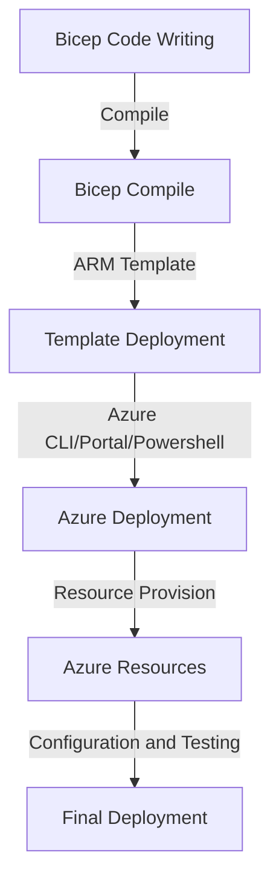

What is bicep and how does it help streamline deployments into Azure? This article will answer this question and help shortcut your learning on yet another DevOps tool.

---

In my day job I'm honored to be one of the interviewers that most technical candidates get to speak with to help vet out those who actually did the things listed on their resumes. I get to talk with some of the smartest and most experienced engineers in our industry and frankly, I love it. Having condensed highly technical discussions about infrastructure, devops, development, the cloud, and more are almost always enlightening for both parties.

I'll write more on dealing with an aggressive technical interviewer like myself in another post. I bring this up as approximately 80% of the last 15 or so engineers I've vetted out for Azure roles have had some experience with the [bicep](https://learn.microsoft.com/en-us/azure/azure-resource-manager/bicep/) tool. That is quite a high number that I could not ignore. Thus this article where I dive into using bicep further.

---

## What is bicep?

**TLDR**: Bicep is a declarative cloud deployment tool for Azure that compiles into ARM templates. 

Recently I explored the CDK for terraform. If you read my article on this journey you may have noticed that there were no formal CDKs listed that target Azure (or Google). As I was looking at this further I found in some forums that bicep mentioned as the Microsoft answer to these cloud development kits. This is mainly because it wraps around ARM templates (json) to give a more pleasant view of the declarative deployments within.

> **Awesome:** Bicep has its own DSL and a good plugin for VSCode that even allows you to paste ARM json directly as bicep code. Nifty!

The DSL (domain specific language) for bicep looks and acts a whole lot like HCL (HashiCorp Config Language) as if it were designed by .Net wonks.

I'll go out on a limb and say that this may be partially due to how hard it is to come up with a declarative syntax that we as humans can actually read. Examples include rego, terraform, html, sql, json, AWS CloudFormation, Azure resource manager templates, and other single use case DSLs such as Dockerfiles and Kubernetes YAML. [Declarative languages](https://declarative.dev/) are all over the place and we in IT have been endlessly trying to make them easier to use.

> **NOTE** Like terraform or rego, bicep runs operations in parallel to build out the graph needed to get the final results. As such, code in bicep manifests need not be ordered in any particular way.

## Workflow

Deploying from bicep code to Azure is similar to most CDKs in that the tool transpiles into another declarative language, the lowly ARM template.



## Terraform vs. Bicep

This is not a comparison for which one to use. You can decide that on your own. If you come from a land of infrastructure as code then likely you are already in deep enough with Terraform to have a love/hate relationship with it. This is a comparison of how things are done in bicep vs. something you already likely know.


| Task | Bicep | Terraform |
| --- | --- | --- |
| **Define a resource**       | `resource storageAccount 'Microsoft.Storage/storageAccounts@2020-08-01' = { ... }` | `resource "azurerm_storage_account" "example" { ... }` |
| **Set resource properties** | `name: 'my-storage-account'` | `name = "my-storage-account"` |
| **Reference a resource** | `resourceGroup().resources\|where(name == 'my-storage-account')` | `azurerm_storage_account.example.id` |
| **Output a resource value** | `output storageAccountKey string = storageAccount.listKeys().key1`  | `output "storage_account_key" { value = azurerm_storage_account.example.primary_access_key }` |
| **Module declaration**      | `module myModule 'my-module.bicep' = { ... }`   | `module "my_module" { source = file("./my-module.tf") }`                  |
| **Parameter declaration**   | `param storageAccountName string`               | `variable "storage_account_name" { type = string }`   |
| **Deployment**              | `az deployment group create --name my-deployment --resource-group my-resource-group --template-file main.bicep` | `terraform apply -var "storage_account_name=my-storage-account"`          |
| **Data Source** | `resource stg 'Microsoft.Storage/storageAccounts@2023-04-01' existing = {`<br/>`name: 'examplestorage'`<br/>`}` | `data "aws_ami" "example" {`<br/>`most_recent = true`<br/>`owners = ["self"]`<br/>`tags = {`<br/>`Name   = "app-server"`<br/>`Tested = "true"`<br/>`}`<br/>`}` |

# Links

General bicep notes:
- As with terraform the name of the resource definition is only symbolic, not the actual name of anything in Azure
- Bicep modules can be other bicep files or ARM json files
- Stick with `[a-zA-Z0-9_]` for symbolic names used in manifest definitions
- The language is strongly typed

## Example - Basic

Here is the most basic of examples, a storage account.

```bicep
resource vStorage_Account 'Microsoft.Storage/storageAccounts@2022-05-01' = {
    name: vStorage_Account_Name
    location: pLocation
    sku: {
        name: 'Standard_LRS'
    }
    kind: 'StorageV2'
    properties: {
        supportsHttpsTrafficOnly: true
    }
}
```


## Example - Less Basic

Here is a more involved example that deploys an AKS cluster I grabbed from[ the bicep site](https://learn.microsoft.com/en-us/azure/aks/learn/quick-kubernetes-deploy-bicep?toc=/azure/azure-resource-manager/bicep/toc.json).

```bash
@description('The name of the Managed Cluster resource.')
param clusterName string = 'aks101cluster'

@description('The location of the Managed Cluster resource.')
param location string = resourceGroup().location

@description('Optional DNS prefix to use with hosted Kubernetes API server FQDN.')
param dnsPrefix string

@description('Disk size (in GB) to provision for each of the agent pool nodes. This value ranges from 0 to 1023. Specifying 0 will apply the default disk size for that agentVMSize.')
@minValue(0)
@maxValue(1023)
param osDiskSizeGB int = 0

@description('The number of nodes for the cluster.')
@minValue(1)
@maxValue(50)
param agentCount int = 3

@description('The size of the Virtual Machine.')
param agentVMSize string = 'standard_d2s_v3'

@description('User name for the Linux Virtual Machines.')
param linuxAdminUsername string

@description('Configure all linux machines with the SSH RSA public key string. Your key should include three parts, for example \'ssh-rsa AAAAB...snip...UcyupgH azureuser@linuxvm\'')
param sshRSAPublicKey string

resource aks 'Microsoft.ContainerService/managedClusters@2024-02-01' = {
  name: clusterName
  location: location
  identity: {
    type: 'SystemAssigned'
  }
  properties: {
    dnsPrefix: dnsPrefix
    agentPoolProfiles: [
      {
        name: 'agentpool'
        osDiskSizeGB: osDiskSizeGB
        count: agentCount
        vmSize: agentVMSize
        osType: 'Linux'
        mode: 'System'
      }
    ]
    linuxProfile: {
      adminUsername: linuxAdminUsername
      ssh: {
        publicKeys: [
          {
            keyData: sshRSAPublicKey
          }
        ]
      }
    }
  }
}

output controlPlaneFQDN string = aks.properties.fqdn
```

## Getting Started

The bicep tool is cross-platform and downloads as a single binary. This is great but for some reason they chose not to make it available as an archive file but rather as a straight binary. Since I didn't want to create a whole asdf-vm or mise plugin for bicep.

## Visualization

Larger infrastructure deployments can often be a nest of dependencies that can be difficult to weed through without some visualizations of the dependencies within. That can be somewhat more painful to do in Terraform as you must be able to build the plan file to get the visualizations. Not so with bicep!

ARM templates have always been easier to visualize due to being simple json data and always having a visualizer in the web console. For bicep you can either generate the json file then drop it into something like [armviz](http://armviz.io/designer). Or you can just right-click on the file in VSCode if you have the plugin available and there will be an option to visualize it baked right in.

## Variables

If you have a stack of variables that need to get passed along to your bicep deployment you can do so via a [parameter file](https://learn.microsoft.com/en-us/azure/azure-resource-manager/bicep/parameter-files?tabs=Bicep) in a similar manner that you might use a `.tfvars` file for Terraform.

## Secrets

This is all text, same as Terraform so you will need to seed your secrets into an Azure Key Vault first then use a built in [getSecret function](https://learn.microsoft.com/en-us/azure/azure-resource-manager/bicep/bicep-functions-resource#getsecret) to pull it into your deployment.

## Pros

There are a few good reasons to pursue using bicep more in your day to day including;
- If you are an all Azure shop this should cover most of your needs
- Arguably easier to grok than Terraform hcl manifests
- State management is mostly handled for you via the resource manager
- No providers to have to manage!
- Some built-in conditional logic and loops exist to make it feel more imperative
- Python-like decorators for some of the tedious aspects of coding declarative languages like this

## Cons

There are some obvious down sides to using bicep;
- There are no providers. If you were planning on doing more than Azure cloud deployments you will need to use escape hatches or other outside scripts to do so.
- Conditional logic is per-resource (no cascading to child resources)- 
- Each bicep file can have no more than 800 resources (is this a con really?)
- And no more than 256 parameters (again maybe rethink your design if you get to this point)

## On the Fence About

Then there are parts of bicep I don't quite know what to make of such as;
- Scopes are set per-bicep file via a variable
	- Except for [extension resources](https://learn.microsoft.com/en-us/azure/azure-resource-manager/management/extension-resource-types)
	- Which are a special kind of resource that can modify the properties of other resources
	- This all just feels that it may be a hassle to deal with
- Yet another language? Why not adopt an approach taken by ckd8s, awscdk, or cdktf and crack open bindings for existing languages like TypeScript or Python? There is even the concept of a 'stack' in bicep (as exists in those development kits).

## My Take

I'll be honest, I'm unlikely to start creating a ton of bicep code for new deployments unless the team I'm with already has investment into this area or I'm asked outright to use it. The workflow for bicep is not that difficult and the code reads pretty easy as well. But having to pickup the nuances of yet another declarative language feels like a step backwards in this realm (but a huge step forwards from hacking at ARM template JSON!).

What is your experience with bicep? What am I missing that so many of my interviewee's seem to have found in using this tool?
