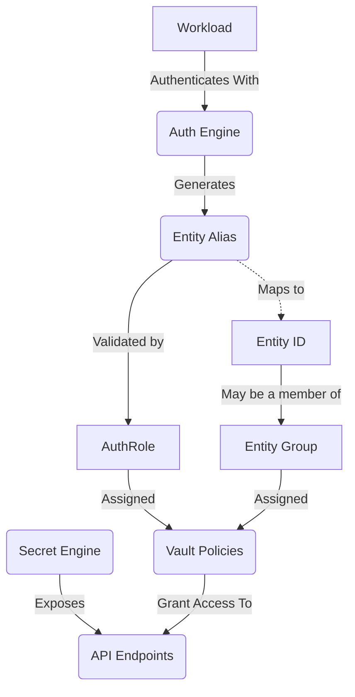
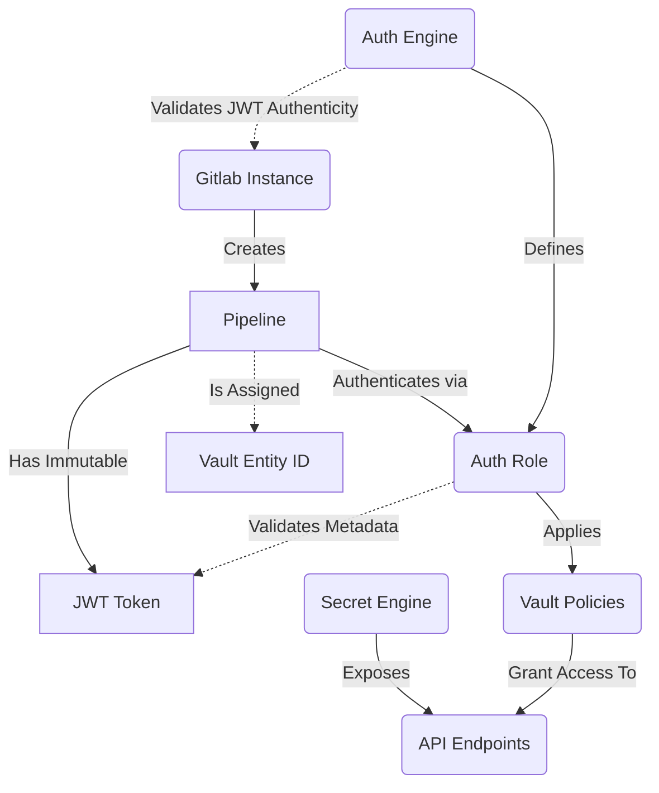
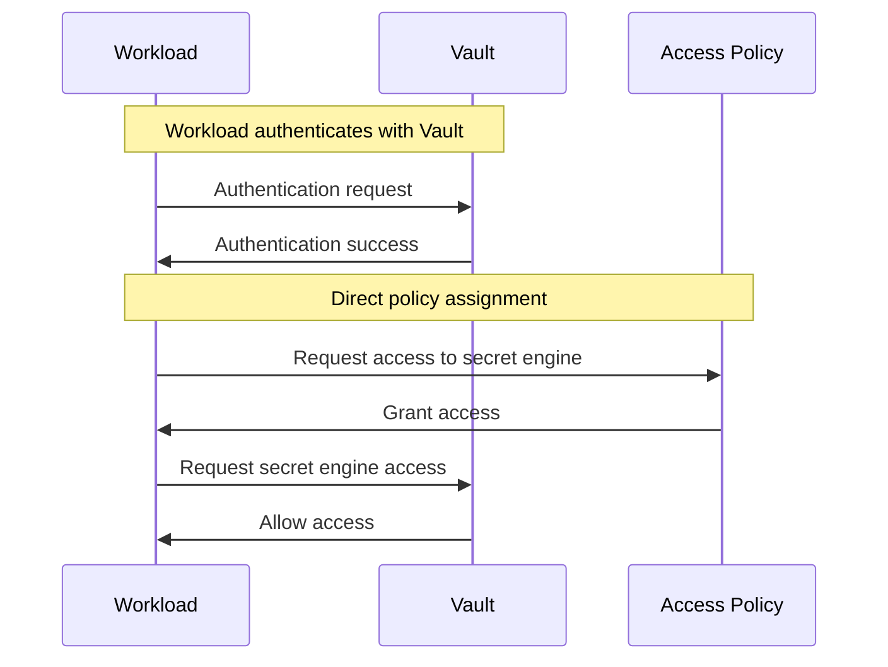
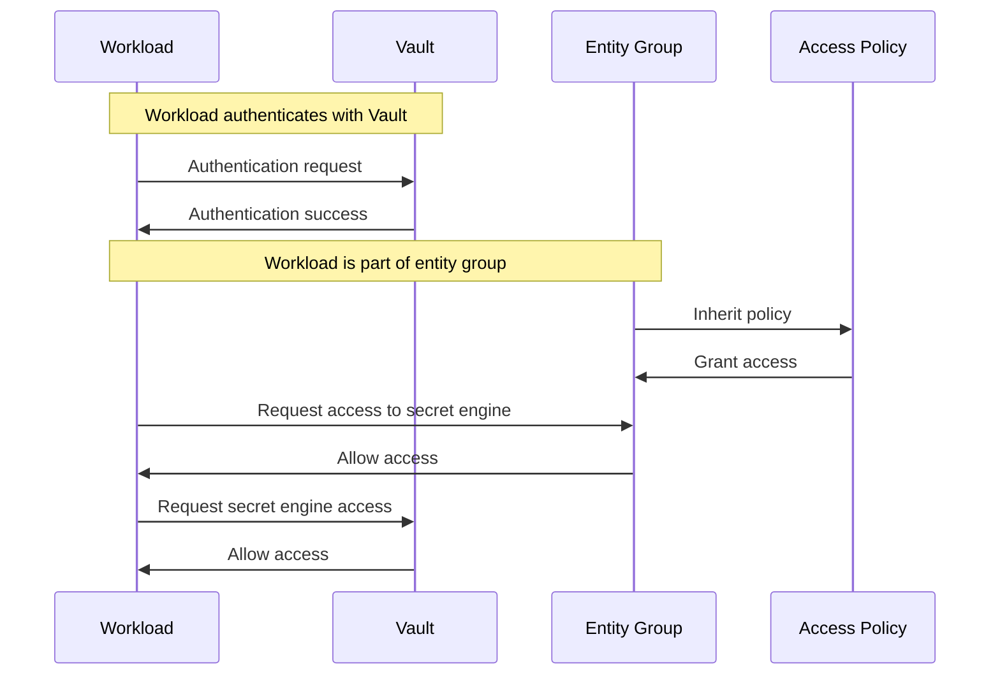

HashiCorp Vault is an industry standard tool used for secrets management in organizations. In this article I will go over some of the nuances to consider while bending this highly adaptable API driven secrets and authentication workhorse to your will.
<!--more-->
# Understanding Vault

So what is HashiCorp Vault?

Similar to Azure Vault or AWS Secrets Manager this product can be used to securely access, store, and retrieve static secrets. Unlike these two vendor locked cloud technologies, Vault can do far more than simple static secrets storage using one of its many available secret and authentication engines. 

Vault can be configured for;
- Hosting static secrets in a key value store
- Hosting a fully automated multi-layer PKI infrastructure
- Generating AWS STS temporary credentials for on-demand AWS IAM role based access to specific cloud resources
- Manage and auto-rotate AD service account credentials
- Provide on-demand SSH access to remote devices via signed certificates
- Dynamically generate roles and access to various databases
- Dynamically create/manage LDAP account credentials
- And more!

## The Basics

Some quick shortcuts you should already likely know:
- Vault can be configured with two engine types; secret and authentication
- Everything in Vault is an API, as such these engines are always exposed via API endpoints once configured
- Access policies are created to target the secrets engines
- Policies are assigned to auth roles, identities, or groups which allows for fine grain control of how the secrets are used

Using the API to authenticate and access Vault secrets is a separate topic entirely and depending on your workloads could span multiple methods. I like to refer to these various secrets consumption methods as 'modalities' (that maybe a carry-over from my days doing large Skype for Business PSTN deployments).

>**NOTE:** Generically the most difficult but highest recommended modality for secrets consumption is direct use of the Vault API via language specific libraries such as [hvac](https://hvac.readthedocs.io/en/stable/overview.html) for Python. Other wrapper modalities like the vault agent, Kubernetes CSI driver, and the AWS Lambda Vault extension are feasible for use for some workload types as well. Or you can just use the vault binary or curl in a pinch!

If you know very little about HashiCorp Vault this diagram will probably be a good start in understanding how the authentication and secrets engines are related.

> **NOTE:** An entity ID is a unique, internal identifier for an entity within Vault, while an Entity Alias is a mapping between the Entity ID and an external identifier specific to a particular authentication method. Multiple aliases can be mapped to an entity id but they must all be from different authentication mounts.
>  
> This is essential to understand if you are looking to reduce licensing costs for Enterprise Vault and for other more advanced troubleshooting in general.

Additionally, each engine type can be defined many times in a single namespace (root or otherwise). Each instance of an engine requires a mount location. This is the top-level hierarchy in the vault API tree. If you read between the lines, this means you cannot create mounts that have existing mount paths within them. If you wanted another key/value (kv) mount and `/kv` already exists, creating the new mount as`kv/mymount` would fail.

> **NOTE** Multiple secret engines are almost certainly required for certain authentication integrations for which multiple id sources could exist. Consider a single Vault cluster servicing multiple Kubernetes clusters for authenticated workloads as an example.

## Secret Engines

Secret engines vary greatly in what they offer but generically are used to manage static or ephemeral secrets. Secret engines require policies to access via a configured authentication engine's role. An example role policy might be to allow the ability to read and write KV secrets in a specific mount path, request the use of an auto-rotating AD service account, and more. Some example secret engines and their super powers are noted below:

* KV - Secure secrets at rest for static secret integrations (The most overrated feature IMHO but this at least time limits access to your secrets at rest)
* AWS - Generate ephemeral AWS STS access keys for IAM Roles
* PKI - Host an API managed PKI multi-tier infrastructure. Automate CRL operations for your PKI team (I personally love this one for cert-manager integrations!)
* MySql/RDS - Short lived database access via dynamically generated credentials
* SSH - Short lived SSH access to servers based on signed certificates
* Transit - Encryption as a service for secrets at rest or in motion that are not hosted in Vault
* LDAP - Managed service accounts for LDAP based systems like Active Directory or RACF 
* More - So many more!

> **Note:** By default, a Vault instance will start with cubbyhole secret engine, a special use secret engine for one-time use password handling via token-wrapping. In standard or dev vault instances the KV secret store is enabled as well.
# Authentication Engines

Vault manages access using (mostly) short-lived authenticated tokens-based access to the various API endpoints involved. As such, the token authentication engine is always enabled at the root namespace.

Other authentication engines in Vault require some source of trusted identity metadata to integrate with to allow for non-repudiation in the authentication process. This can be better understood via an example integration.

If you were to integrate with an internal GitLab cluster for authentication you will need to configure the trusted JWKS URL to validate JWT tokens against. Then for each role defined on the auth mount you have created you would configure the allowed JWT claims that Vault would need to validate for in the authentication process. These immutable claims assert various bits of pipeline data that we can use to validate that the running pipeline JWT token used to authenticate with Vault are from the source project or project group we have defined. 

> **Note:** A simpler auth method like userpass or approle use static credentials as a means of validating the requesting client is valid. For these reasons I highly recommend against using them despite their widespread usage in published Vault configuration examples!

# Best Practices

Now that you know more about the Vault landscape lets discuss some best practices when configuring Vault for your organization.
## Assign Policies to Entity Groups instead of Roles

It can be easy to gloss over Vault entity groups when learning about this powerful secrets platform. This is largely because entity groups appear to be simply another abstraction layer. Additionally, ***examples in the Vault documentation do not employ entity groups for policy assignments at all***. Most Vault guides and examples will have the reader directly assign some manually constructed policy to specific Vault authentication engine role.

This approach works very well within the scope of a single authentication mount for a single team or for light examples. But this also tightly couples the policy assignment with the vault role.

> **Tip:** What are your current policy assignments? Simple, look up info on your token (`vault token lookup`). Policies that were directly inferred from a role assignment show under the `policies` attribute, those assigned via entity groups are listed in the `identity_policies` attribute.

You may start to believe that simply assigning your Vault policies to your Vault roles is 'good enough'. But nothing could be further from the truth!

Multiple authentication mounts can be used by the same identity to gain access to Vault secret engines. If you follow the role based policy assignments then you will be forced to configure each individual role with the applicable policies. This ultimately does not scale well and will lead you down a path of frustration. Entity groups solve this problem by giving you a single place to manage policies.

![[Pasted image 20250107122917.png]]

![[Pasted image 20250107122240.png]]

## Use Multi-part Mount Path Prefixes

This last best practice seems pretty straight forward but be cognizant that whatever auth or secret mounts you are currently defining may not be the last ones you will ever need for that kind of mount.

For example, if you are adding a new Kubernetes cluster for native integration and create it in the mount path of `/kube` you are essentially shooting yourself in the foot. This cluster will get integrated but now you can never have another cluster configured in this vault instance with that prefix. It is far more flexible to create multi-part mount prefixes for both your policies and for future integrations.

Ask yourself; Do you know that it will be the last one? Will you need to carve out future clusters both in the cloud and on premise? Are there multiple teams that own the clusters? These kinds of questions should be asked for all of your Vault integrations.

I typically like to have the first path prefix for mounts be the type of mount, then a qualifier for either environment or team or location, then the target. In the Kubernetes cluster example you might end up with your first auth mount as `/kube/onprem/cluster1`

# Conclusion

Hopefully your Vault journey is a bit smoother with this information. Vault is a very versatile secrets management platform that may take some time to design correctly but I promise it is well worth the effort when you do!

