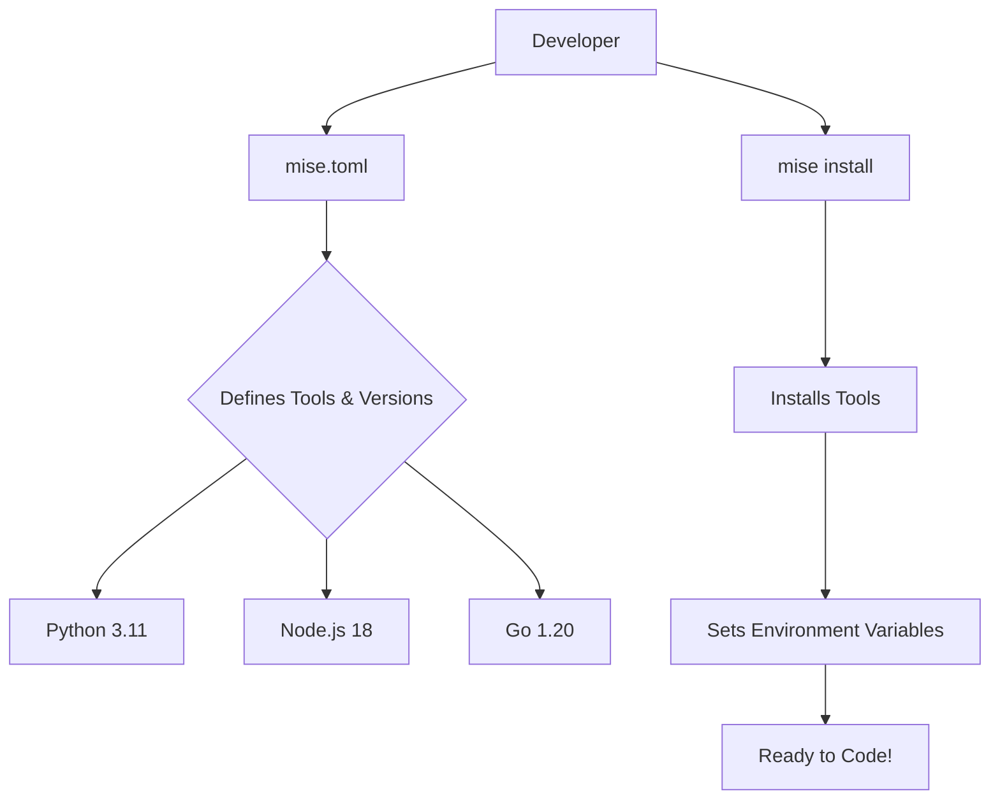

Developing software across multiple programming languages and projects can feel like juggling flaming chainsaws while riding a unicycle. The additional cognitive load of getting things in place locally for your workstation for some other team's project can really slow a day down. Each language comes with its own ecosystem, version managers, and dependency hell. One project might require Python 3.11, another Node.js 18, and yet another Go 1.20. Keeping your local development environment in sync with these requirements is a nightmare. Containers like Docker can help, but they often feel heavy-handed for local development. And then there’s Nix—powerful, but let’s be honest, it’s like learning a new language just to manage your tools.

Enter **asdf-vm**, the tool that promised simplicity. It was a breath of fresh air—a single tool to manage multiple runtime versions. But as I dug deeper, I stumbled upon **aqua**, which added a layer of declarative configuration. Finally, I discovered **mise** (formerly known as **rtx**), and it felt like the missing piece of the puzzle. Mise combines the simplicity of asdf-vm with the declarative power of aqua, making it my go-to tool for managing local development environments.

## In this post, I’ll walk you through how I use [mise](https://mise.jdx.dev) to tame the chaos of multi-language development, complete with a `mise.toml` example to configure a project.

## Why Mise?

Mise is a tool that allows you to define your project’s runtime requirements in a simple, declarative way. It’s like having a personal assistant who knows exactly which tools and versions you need for each project. Here’s why I love it:

1. **Declarative Configuration**: Define your tools and versions in a `mise.toml` file.
2. **Multi-Language Support**: Works with Python, Node.js, Go, Ruby, and more.
3. **Multi-Package Manager Support:** Can install packages from asdf-vm, aqua, npm, pipx, ubi, go, gem, dotnet, cargo, spm, and vfox (vfox?)
4. **Simple Setup**: No need to wrestle with containers or learn a new ecosystem like Nix.
5. **Seamless Integration**: Works alongside your existing tools and workflows.
6. **Direnv Support:** Can inject local `.env` files into your environment.

You get lots of wins using mise.

---

## Example: Using `mise.toml` to Configure a Project

Let’s say you’re working on a project made by some maniac that requires:

- Python 3.11
- Node.js 18
- Go 1.20
  Additionally, perhaps this project requires some environment variables as secrets in the git ignored `./.SECRETS.env` and some generic environment variables in `.env`.

Here’s how you can define these requirements in a `mise.toml` file. You would drop this into the project folder you are working on.

```toml
[tools]
python = "3.11"
nodejs = "18"
go = "1.20"

[[env]]
_.source = './.env'
PYTHONPATH = "./src"
NODE_ENV = "development"

[[env]]
_.source = './.SECRETS.env'
SOMETHING = "nope"
```

With this file in place, running `mise install -y` will automatically install the specified versions of Python, Node.js, and Go. Mise also sets up the environment variables defined and sources in the secrets.

> **NOTE:** This is all predicated on mise being injected into your console session.

You may notice that the versions are at the minor semver level. This should net you the latest patch semver release for that software. You can, and probably should, pin these versions to the exact version for a project you maybe inheriting.

---

## Visualizing the Workflow with Mermaid

Let’s break down the workflow with a Mermaid diagram:



---

## Why This Matters

Managing development environments shouldn’t be a full-time job. With mise, you can spend less time configuring tools and more time writing code. It’s simple, declarative, and works seamlessly across multiple languages. Whether you’re a solo developer or part of a team, mise can help you standardize your development environment and reduce onboarding friction.

---

## Give Mise a Try

If you’re tired of juggling versions and wrestling with containers, give mise a shot. It’s a game-changer for multi-language development. Here’s how to get started:

[Install mise](https://mise.jdx.dev/getting-started.html):

```bash
curl https://mise.jdx.dev/install.sh | sh
echo 'eval "$(~/.local/bin/mise activate zsh)"' >> ~/.zshrc
```

1. Create a `mise.toml` file in your project.
2. Run `mise install` and start coding!

---

## Retrofitting An Existing Project

Typically I'll just add the `mise.toml` file at the project root including only the following:

- Used programming languages
- Build tools (jq, yq, task, et cetera)

I then add a local `./configure.sh` file at the root like this:

```bash
#!/usr/bin/env bash

# Check for GITHUB_TOKEN to not be rate limited
if [ -z "$GITHUB_TOKEN" ]; then
    echo "GITHUB_TOKEN is not set. Please set it and try again."
    exit 1
fi

# check for mise
if ! command -v mise &>/dev/null; then
    echo "Please install mise first (run 'curl https://mise.run | sh')"
	echo ""
    exit 1
else
    eval "$(mise activate bash)"
fi

## This is optional if you require any [env] sections be processed
#mise settings set experimental true
#mise trust

# Install all dependencies
mise install -y
```

> **WARNING:** I'd ensure you have the `GITHUB_TOKEN` env var in place using your own created PAT. This will ensure rate limiting doesn't ruin your day.

If you have some unique tool that is not an asdf-vm plugin you can add software via any one of the [back end package providers]() supported. I've found that aqua may have some newer packages. But you can also try your luck with the [`ubi`](https://mise.jdx.dev/dev-tools/backends/ubi.html) backend. This one hits up GitHub releases and tries to guess the latest release for your architecture.

## Results

I'm very happy with how well it integrates with my console sessions and shims the right application versions based on my location seamlessly. You can get rather fancy with the ability to source .env files (they are essentially bash scripts).

## Bonus - Sops Integration

You can have your secrets encrypted via sops and an age key and mise should handle the decryption entirely behind the scenes. I've created an example of this in [this project](https://github.com/zloeber/mise-encryption-example) for your convenience. This project uses a generated age key to encrypt a local `.secrets.env.json` file for inclusion into the local environment via mise.

---

Happy coding, and may your development environments always be easy to use!
