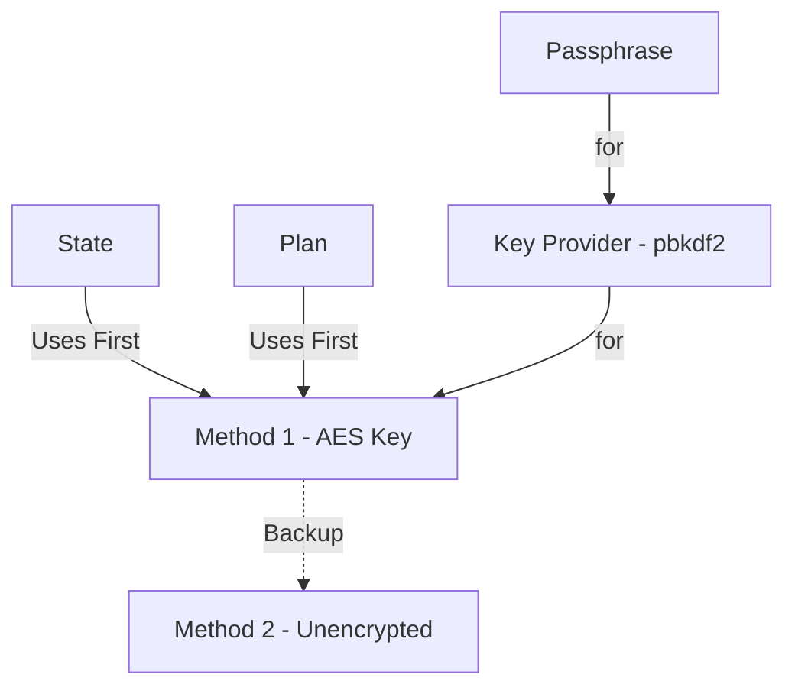

In the evolving world of infrastructure-as-code (IaC), tools like OpenTofu are pushing boundaries, enabling developers to efficiently manage and deploy infrastructure. The OpenTofu team has been on a roll with new features to address some of the longest running complaints in the terraform community. 

Two standout features that have been catching my attention recently are encrypted state and provider iteration. While both are intriguing, they deserve a closer examination to understand their potential impact—and limitations—in real-world scenarios. 

My requirement will be to maintain bootstrap code and its state in git without the need for a third party vault, cloud storage, or additional secret sprawl. The locally stored state JSON file will have root level secrets and other sensitive configuration data that should only be decrypted via my local age private key. I lay out fully working examples of how this might be done with both standard terraform and via OpenTofu's encrypted state.

---

## Working Example - Part 1 (Terraform)

To explore this further I'll start with a deployment done entirely via Terraform. 

**PROJECT**: [tofu-exploration](https://github.com/zloeber/tofu-exploration/)
**BRANCH**: main

The `main` branch includes terraform manifests for deploying 2 kind clusters side by side. The state is stored for each component as separate terraform state files in the `./secrets` folder. This folder is then targeted with `sops` to encrypt contents within.  

```bash
# Bring cluster1 and cluster2 up
task deploy:all

# Here you should review secrets and other state stuff in ./secrets.
# Don't commit this to git yet!
```

After this has completed you should have a handful of files in the local `./secrets` folder including:

- Kubernetes configuration files with full rights to your created clusters
- Additional per-cluster public and private keys
- Infrastructure and per-cluster state files with all applied terraform (including the generated ssh private keys and other sensitive information)

### Encrypting Local State

Both plan and state files are inherently plain text. We can encrypt the state files easily enough though. To start you will need some private key that is kept locally. I've chosen age keys with [sops](https://github.com/getsops/sops). You could use PGP or anything that sops supports.

```bash
task | grep sops # Show a list of our convenience tasks
task sops:show # Show all the variables setup for the tasks

task sops:age:keygen # Generate a local age key
task sops:init # Initialize this project repo with your public age key
task encrypt:all # Encrypt every file in the ./secrets folder
```
  
You can now review the secrets files and see that they have all been encrypted. Binary looking files like ssh keys will be converted to json format with the information required to decrypt them baked into the metadata (obviously minus our private age key).

With the age private key in `~/.config/sops/age/keys.txt` and all secrets files are encrypted you can now safely commit your changes to git.

When you need to decrypt and run terraform operations again:

```bash
task decrypt:all
```

> **NOTE** You can and should use pre-commit hooks to prevent accidentally committing your secrets!

### Issues

There are some downfalls to this approach:

1. **Concurrency Issues**: Terraform state files stored in git do not support concurrent operations. It just doesn't work that way with local state and this knid of model.
2. **Access Control**: Managing access to the encrypted state files can be challenging. Ensuring that only authorized users have access to the decryption keys and the ability to modify the state requires careful key management and access control policies.
3. **Key Management**: The security of the encrypted state files relies heavily on the management of encryption keys. Losing the keys or having them compromised can result in the inability to decrypt the state files or unauthorized access to sensitive information.
4. **Complexity**: Encrypting and decrypting state files adds an additional layer of complexity to the workflow. Users need to be familiar with the encryption tools and processes, which can increase the learning curve and potential for errors.
5. **Performance**: Encrypting and decrypting state files can introduce performance overhead, especially for large state files or when frequent operations are required. This can slow down the overall workflow and impact productivity.
6. **Backup and Recovery**: Ensuring that encrypted state files are properly backed up and can be recovered in case of data loss is crucial. This requires additional planning and processes to ensure that backups are secure and accessible when needed.
7. **Auditability**: Tracking changes to the state files and understanding the history of modifications can be more difficult when the files are encrypted. This can impact the ability to audit changes and troubleshoot issues effectively.

> **NOTE** There are some ways around the key management with external systems like HashiCorp Vault or Azure Key Vault.

### Clean Up

To remove the clusters and clean up your work in preparation for opentofu run this:

```bash
# Tear it down
task destroy:all
```

## Working Example - Part 2 (OpenTofu)

Using the same code from main I created this version that uses tofu encryption in the `tofu-encryption` branch.

**PROJECT**: [tofu-exploration](https://github.com/zloeber/tofu-exploration/)
**BRANCH**: tofu-encryption

This is the same deployment is done using opentofu's encrypted state instead of sops. First big update is that we are changing the binary used in our main `Taskfile.yml` definition to tofu.

**NOTE** I did try to use the VSCode plugin for OpenTofu but it was not very helpful for the more recent features (like the encryption block).

### State/Plan Encryption

As [per the docs](https://opentofu.org/docs/language/state/encryption/) we can encrypt state and plan data with native opentofu.

This can be enabled via the `TF_ENCRYPTION` environment variable or in the terraform block. The way this works is that you define a `method` which can optionally contain key providers or other configuration for encryption. The key providers and methods available are not so large currently but it is still enough to get along.

> **Vault Transit Support** is not available if vault is running beyond 1.14 (the license change). It is experimental for openbao otherwise.

Anyway, the methods are assigned to the `state` and/or `plan` terraform definitions as either the primary or backup encryption types.



You can infer that your entry point for secret zero in a local file based state encryption will be that passphrase. We need to use something greater than 16 characters and private. The age private key can be used for this easily enough by setting the `TF_VAR_state_passphrase` variable I created just for this purpose.

**Important!** Ensure you have your local age key pair created with `task sops:age:keygen` (existing key will always be preserved).

With this in place I updated the local `Taskfile.yml` manifest to automatically source the private key value into that environment variable so it could be in place for encryption and added the relevant terraform.encryption block and variables for each terraform stack we are targeting.

If we run the deployment with no further changes then it automatically encrypts the terraform state files when we deploy via `task deploy:all`.

This does **not** encrypt any of the generated files we dump into that folder!

Specifically the argo git ssh keys and the kubernetes configuration files are not covered in this case. But we have that data from our state so we simply start ignoring them via `.gitignore` knowing we can always recreate them later via the encrypted state and `task deploy:all`.

> **Interesting:** Because the kind provider I used doesn't track the local config file resource when it gets created, I needed to make changes to isolate the kubeconfig files to their own generated file resources instead.

With this in place we should be able to push state up to your git repo directly after any kind of state altering task has been done, clone it later to another machine with the same age private key, and run through the deployment lifecyle again.

## Results

I'm really happy with how fluid encrypted state works and will definitely be using it for some personal projects. You just need to remember to keep all your secrets in state when doing something off the wall (like storing your IaC state as a file in git).  I've yet to explore what it will take to inject other known secrets into state safely either.
