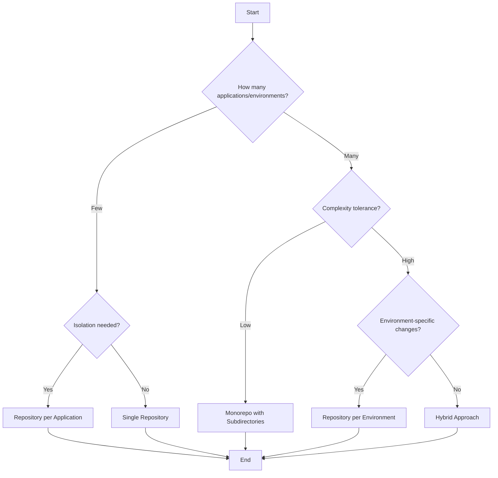

There are many roads to GitOps. I'm going to outline a few of them.

|**Strategy**|**Description**|**Pros**|**Cons**|
|---|---|---|---|
|**Single Repository**|All applications, environments, and configurations are stored in one repository.|Simplifies management and visibility.|Can become cluttered and difficult to scale for large teams/projects.|
|**Repository per Environment**|Separate repositories for each environment (e.g., dev, staging, prod).|Clear separation of concerns; easier to manage environment-specific changes.|Requires synchronization across repositories; may lead to duplication.|
|**Repository per Application**|Each application has its own repository with its configurations and environments.|Isolates changes; easier to manage application-specific workflows.|Increases the number of repositories; harder to manage cross-application changes.|
|**Monorepo with Subdirectories**|Single repository with subdirectories for applications and environments.|Centralized management; easier to enforce standards.|Can become complex as the number of applications/environments grows.|
|**Hybrid Approach**|Combines strategies (e.g., monorepo for shared resources, per-app for specifics).|Flexible; balances simplicity and isolation.|Requires careful planning and governance to avoid confusion.|

---

### Flowchart for Selecting a GitOps Repository Management Strategy

Below is a Mermaid diagram flowchart to help an IT team decide on a GitOps repository management strategy:

## Additional Resources

- [GitOps Repo Patterns - Part 6](https://platform.cloudogu.com/en/blog/gitops-repository-patterns-part-6-examples/)
- []
