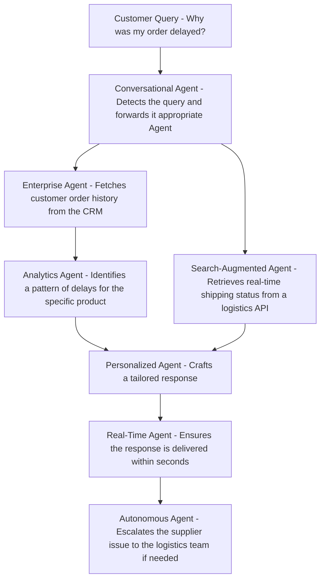

On the wake of DeepSeek R1's tidal wave across our industry I'm going to wax poetic on our current state of affairs in AI. In this discussion I'll describe traditional vs. agentic IT solutions with an eye on overall cost in both time and compute.

---

Artificial Intelligence's beautiful offspring, the large language model (LLM), has forced a collective pivot from traditional computer coding into conversational declarative machines we know as 'agents'. Just as certainly that 'agentic' will be a new dictionary word by 2026, we are going to witness further democratization of AI across all aspects of our life. As IT geeks move forward with these new tools to start hacking together awesome solutions lets first remember that both traditional and AI based engineering in our industry suffer some of the same issues. Including (but not limited to);

- Remaining compliant with regulations
- Data safety
- High availability
- Maintainability (tech debt)
- Cost

Although I have opinions on all of these, this article will cover how much cost factors into your solutions when using AI agents vs. traditional compute based solutions.

## Stages for Creating a Solution

Lets follow this outline for how we develop solutions.

1. **Define Objectives**: Clearly outline the goals and expected outcomes of the solution.
2. **Identify Requirements**: Determine the necessary resources, data inputs, and integrations needed for the solution.
3. **Design Architecture**: Plan the overall structure, including the types of agents required and their interactions.
4. **Develop Services/Agents**: Create individual services/agents with specific functionalities, ensuring they can operate independently and collaboratively.
5. **Integrate Systems**: Connect services/agents with external APIs, databases, and other systems to enable data flow and interaction.
6. **Test and Validate**: Conduct thorough testing to ensure each agent performs as expected and the overall solution meets the objectives.
7. **Deploy Solution**: Roll out the solution to the production environment, ensuring all components are operational.
8. **Monitor and Optimize**: Continuously monitor the performance of the services and make necessary adjustments to improve efficiency and effectiveness.
9. **Maintain and Update**: Regularly update the solution and underlying systems to adapt to new requirements and technological advancements.

If you pit traditional compute against agent based solutions and assign them a cost it might turn out like this:

| **Step**                       | **Traditional Compute** | **Agentic Compute** | **Reasoning**                                                                                                                   |
| ------------------------------ | ----------------------- | ------------------- | ------------------------------------------------------------------------------------------------------------------------------- |
| **1. Define Objectives**       | Very Low                | Very Low            | Defining objectives is similar in complexity for both approaches.                                                               |
| **2. Identify Requirements**   | Low                     | Low                 | Identifying requirements is comparable, though agentic systems may need additional considerations for autonomy.                 |
| **3. Design Architecture**     | Medium                  | High                | Agentic systems require more complex designs to handle autonomous interactions and decision-making.                             |
| **4. Develop Services/Agents** | High                    | Very High           | Developing agents involves creating autonomous, collaborative entities, which is more complex than traditional services.        |
| **5. Integrate Systems**       | Medium                  | High                | Agentic systems require more sophisticated integration to enable seamless communication between autonomous agents.              |
| **6. Test and Validate**       | High                    | Very High           | Testing agentic systems is more complex due to the need to validate autonomous behavior and interactions.                       |
| **7. Deploy Solution**         | Medium                  | High                | Deploying agentic systems may involve additional challenges, such as ensuring agents operate correctly in dynamic environments. |
| **8. Monitor and Optimize**    | Medium                  | High                | Agentic systems require continuous monitoring and optimization to handle evolving scenarios and improve decision-making.        |
| **9. Maintain and Update**     | High                    | Very High           | Maintaining agentic systems is more demanding due to the need to adapt to new requirements and ensure agents remain effective.  |

## Traditional Compute Solutions

Developing solutions traditionally requires us to create some software then deploy it for use. Standard compute is your traditional infrastructure cost plus the cost of the application development and automated delivery to your chosen platform. Chosen platform's encompass much of our current known IT infrastructure landscape. It includes serverless, vms, kube containers, bare metal and more. In this model, costs weigh in heavy at the start for initial design, development, and testing. The receipt for a traditional IT solution for your business may itemize to a longer bill than you realize.

**App** - Custom development, unit tests, design (often x2 for frontend vs. backend)
**State** - Online storage, relational/document databases, cache
**CICD Substrate** - Github/Gitlab, pipelines, devops automation, pipeline compute
**Artifact Repository** - containers, packages, Artifactory/Other
**Deployment Scaffolding** - Certificates, domains, backup/restore plans, disaster recovery plans, business continuity plans, more
**Infrastructure** - Kube cluster, serverless, vm, hosted services, cloud resources
**Maintenance** - Ongoing upgrades, updates, and support

> **Important** A good design at the very start can often seriously reduce the costs at the infrastructure end of the solution.

## AI Compute

It helps to mentally abstract AI as just another compute that that you have access to when creating your solutions. AI compute just happens to be far more expensive (usually in both money and time!) than standard compute substrates for your workloads. It is also requires a fastidious eye for text and a penchant for logic, it requires a developer. It just requires much less from that developer as they will not be coding out every aspect of an API or web service running for each individual agent. Instead the developer is creating multiple english language declarative state machines working in tandem.

AI compute has sub-categories, they are clearly not all doing the same work. One agent that is categorizing an image is not the same as an agent that does a web search then spins out multiple additional agents to process results.

I had [DeepSeek R1](chat.deepseek.com) create a decent categorized list for me with the following prompt:

```prompt
Create a categorized list of AI agents by cost. For example, an AI agent that only accepts input and uses the LLM and no external searches would cost less than a web search agent which may cost less than an agent that consumes a full RAG on demand. I'd like every kind of categorized agent you can think of that would differentiate their costs. Create this list as a markdown table with qualifying attributes and a short name.
```

| **Short Name**             | **Qualifying Attributes**                                                                            | **Cost Level** | **Reason for Cost**                                                                                  |
| -------------------------- | ---------------------------------------------------------------------------------------------------- | -------------- | ---------------------------------------------------------------------------------------------------- |
| **Basic LLM Agent**        | Accepts input, processes it using a pre-trained LLM, and generates output. No external integrations. | Low            | Minimal computational resources; no external API calls or additional processing.                     |
| **Search-Augmented Agent** | Uses LLM + external search APIs (e.g., web search, knowledge graphs) to retrieve information.        | Medium         | Adds cost of API calls, latency, and data processing for search results.                             |
| **RAG Agent**              | Implements Retrieval-Augmented Generation (RAG) to fetch and process external data on demand.        | High           | Requires embedding models, vector databases, and additional compute for retrieval and synthesis.     |
| **Multi-Modal Agent**      | Processes text, images, audio, or video inputs using multi-modal models (e.g., GPT-4 Vision).        | High           | Higher computational cost due to processing diverse data types and larger model sizes.               |
| **Fine-Tuned Agent**       | Uses a custom fine-tuned LLM for specific tasks or domains.                                          | High           | Cost of fine-tuning, hosting, and maintaining a specialized model.                                   |
| **Autonomous Agent**       | Operates autonomously, making decisions, taking actions, and iterating without human intervention.   | Very High      | Requires advanced planning, memory, and decision-making capabilities; often involves multiple tools. |
| **Real-Time Agent**        | Processes inputs and generates outputs in real-time with low latency (e.g., for customer support).   | Medium-High    | Requires optimized infrastructure and potentially dedicated resources for low-latency performance.   |
| **Batch Processing Agent** | Processes large datasets or batches of inputs offline.                                               | Medium         | Lower per-unit cost but scales with data volume; may require significant compute resources.          |
| **Personalized Agent**     | Tailors responses based on user history, preferences, or context (e.g., recommendation systems).     | Medium-High    | Requires user profiling, memory storage, and context-aware processing.                               |
| **Multi-Agent System**     | Coordinates multiple AI agents to work together on complex tasks.                                    | Very High      | High coordination costs, communication overhead, and resource allocation across agents.              |
| **Edge AI Agent**          | Runs on edge devices (e.g., smartphones, IoT devices) with limited compute resources.                | Low-Medium     | Optimized for low-power environments but may require custom development and maintenance.             |
| **Enterprise Agent**       | Integrates with enterprise systems (e.g., CRM, ERP) and handles sensitive data securely.             | High           | Requires robust security, compliance, and integration with legacy systems.                           |
| **Generative Agent**       | Focuses on creative tasks like writing, design, or code generation.                                  | Medium         | May require larger models or specialized fine-tuning for high-quality outputs.                       |
| **Analytics Agent**        | Performs data analysis, generates insights, and creates visualizations.                              | Medium-High    | Requires integration with data pipelines, analytics tools, and potentially large datasets.           |
| **Conversational Agent**   | Engages in extended, context-aware dialogues with users (e.g., chatbots).                            | Medium         | Requires memory and context management, but lower cost than autonomous or multi-agent systems.       |
| **Hybrid Agent**           | Combines multiple capabilities (e.g., RAG + multi-modal + autonomous decision-making).               | Very High      | High complexity and resource requirements due to combining multiple advanced features.               |

Key Cost Drivers:

- **Compute Resources**: Larger models or real-time processing increase costs.
- **External Integrations**: APIs, databases, and tools add to operational expenses.
- **Customization**: Fine-tuning or specialized models require additional investment.
- **Scalability**: Agents handling large volumes of data or users incur higher costs.
- **Autonomy**: Agents with decision-making capabilities are more expensive to develop and maintain.

The best solutions in the future will almost certainly have to figure out how to blend AI agent and traditional compute solutions to accomplish business goals.

## Simple Example - Large Document Processing

This is a very practical use of LLMs, summarize a document. But there are token limitations. Using several agents to chunk out the work and bring it all together at the end is a reasonable solution to these limitations. In the scenario below we end up with 6x the number of requests for compute.

**Scenario**: Multiplex LLM processing of very large documents.
**Objective**: Suppose you have a 10,000-token document and need to generate a detailed summary. Here's how you could use a multi-agent framework:

1. Partition the Document:
   Split the document into 5 sections of 2,000 tokens each.
2. Assign Summarization Agents:
   Use 5 agents, each summarizing one section.
3. Run Agents in Parallel:
   Execute all 5 agents simultaneously.
4. Aggregate Summaries:
   Use a final agent to combine the 5 summaries into a single, coherent summary.

## Advanced Example - ERP Customer Service Bot

This is a more fleshed out example of doing some realistic work. This agent workflow services a user with a bunch of great info by integrating with the internal systems to provide relevant data and responses. Though I'm pretty certain one could code out the logic for everything beyond the conversational agent and eliminate all the other agents if they were so inclined.

**Scenario**: Enterprise Customer Support System
**Objective**: Provide end-to-end customer support by resolving inquiries, analyzing customer data, retrieving relevant information, and offering personalized solutions in real-time.

### Agents Involved

| **Short Name**             | **Qualifying Attributes**                                                                            | **Cost Level** | **Reason for Cost**                                                                                  |
| -------------------------- | ---------------------------------------------------------------------------------------------------- | -------------- | ---------------------------------------------------------------------------------------------------- |
| **Basic LLM Agent**        | Accepts input, processes it using a pre-trained LLM, and generates output. No external integrations. | Low            | Minimal computational resources; no external API calls or additional processing.                     |
| **Search-Augmented Agent** | Uses LLM + external search APIs (e.g., web search, knowledge graphs) to retrieve information.        | Medium         | Adds cost of API calls, latency, and data processing for search results.                             |
| **RAG Agent**              | Implements Retrieval-Augmented Generation (RAG) to fetch and process external data on demand.        | High           | Requires embedding models, vector databases, and additional compute for retrieval and synthesis.     |
| **Multi-Modal Agent**      | Processes text, images, audio, or video inputs using multi-modal models (e.g., GPT-4 Vision).        | High           | Higher computational cost due to processing diverse data types and larger model sizes.               |
| **Fine-Tuned Agent**       | Uses a custom fine-tuned LLM for specific tasks or domains.                                          | High           | Cost of fine-tuning, hosting, and maintaining a specialized model.                                   |
| **Autonomous Agent**       | Operates autonomously, making decisions, taking actions, and iterating without human intervention.   | Very High      | Requires advanced planning, memory, and decision-making capabilities; often involves multiple tools. |
| **Real-Time Agent**        | Processes inputs and generates outputs in real-time with low latency (e.g., for customer support).   | Medium-High    | Requires optimized infrastructure and potentially dedicated resources for low-latency performance.   |
| **Batch Processing Agent** | Processes large datasets or batches of inputs offline.                                               | Medium         | Lower per-unit cost but scales with data volume; may require significant compute resources.          |
| **Personalized Agent**     | Tailors responses based on user history, preferences, or context (e.g., recommendation systems).     | Medium-High    | Requires user profiling, memory storage, and context-aware processing.                               |
| **Multi-Agent System**     | Coordinates multiple AI agents to work together on complex tasks.                                    | Very High      | High coordination costs, communication overhead, and resource allocation across agents.              |
| **Edge AI Agent**          | Runs on edge devices (e.g., smartphones, IoT devices) with limited compute resources.                | Low-Medium     | Optimized for low-power environments but may require custom development and maintenance.             |
| **Enterprise Agent**       | Integrates with enterprise systems (e.g., CRM, ERP) and handles sensitive data securely.             | High           | Requires robust security, compliance, and integration with legacy systems.                           |
| **Generative Agent**       | Focuses on creative tasks like writing, design, or code generation.                                  | Medium         | May require larger models or specialized fine-tuning for high-quality outputs.                       |
| **Analytics Agent**        | Performs data analysis, generates insights, and creates visualizations.                              | Medium-High    | Requires integration with data pipelines, analytics tools, and potentially large datasets.           |
| **Conversational Agent**   | Engages in extended, context-aware dialogues with users (e.g., chatbots).                            | Medium         | Requires memory and context management, but lower cost than autonomous or multi-agent systems.       |
| **Hybrid Agent**           | Combines multiple capabilities (e.g., RAG + multi-modal + autonomous decision-making).               | Very High      | High complexity and resource requirements due to combining multiple advanced features.               |

### Workflow

1. Customer Interaction:

   - The Conversational Agent receives a customer query (e.g., "Why was my order delayed?"). It classifies the query and determines if it requires external data or personalized insights.

2. Information Retrieval:

   - If the query requires external data, the Search-Augmented Agent retrieves real-time information (e.g., shipping status from a logistics API).
   - If the query requires internal data, the RAG Agent fetches relevant information from internal documents or databases (e.g., order history, policies).

3. Data Analysis:

   - The Enterprise Agent pulls customer data from the CRM (e.g., past orders, preferences).
   - The Analytics Agent analyzes this data to identify patterns or insights (e.g., frequent delays for a specific product).

4. Personalization:

   - The Personalized Agent uses the analytics insights to tailor the response (e.g., "Your order was delayed due to a supplier issue. We’ve applied a 10% discount to your next purchase.").

5. Real-Time Coordination:

   - The Real-Time Agent ensures the response is delivered quickly and coordinates with other agents to prioritize urgent queries.

6. Autonomous Oversight:
   - The Autonomous Agent monitors the system, resolves conflicts (e.g., if two agents provide conflicting responses), and escalates complex issues to human agents.



## Multi-Compute Future

It will take a careful balance between agents, traditional services, and agents that build traditional services to create durable and cost effective IT solutions moving forward. As our little human language declarative state machines become more prevalent so to will their solutions. I cannot wait to see what we develop with all of these new tools at our disposal!

## My Wish List

In my mind's eye I envision a multi-modal input capable system that augments my life so that I can attain [slack](). I've been constructing a mental list of how this system might look.

I will need agents to fill the following needs:

- An intelligent reminder agent
- A customization agent
- Family vacation planning agent (set)
- Controller agent
- Cost optimization agent
-
- Agent inventory (shared)
- Agent Web Searcher (shared)
-
- A long term memory extension agent.
  - Remember that baobab can be installed as a local GUI for disk space visualization.
  -
