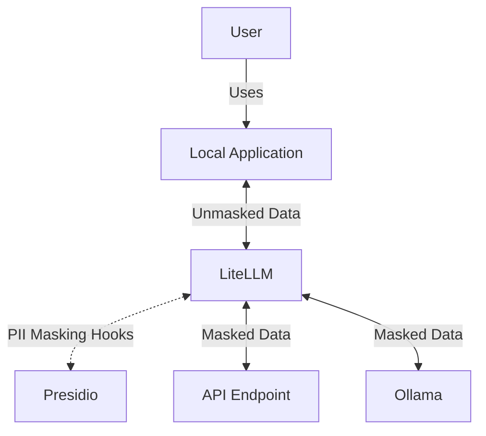

Today I explore using a few tools in tandem to provide a personalized AI firewall proof of concept. We will setup Microsoft's presidio along with Ollama to act as a proxy for your LLM API requests. Presidio will extract personal identifying information before sending things along with fake data. On the way back the scrubbed data will be replaced as if nothing were touched.

---
> **NOTE**: Proof of concept means it will work but is not very fast and will require further exploration to be useful.

## About

This was all setup on a Linux Mint workstation but should easily run on other platforms due to the containers being used. The connected components are pretty simple.



## LiteLLM

This is the main proxy we will use. It integrates with a large number of external LLM targets and provides an OpenAI-compatible local target for our requests. It also supports Presidio by default!

You can use YAML to configure LiteLLM so lets do that now.

```yaml
# config/litellm.yaml

model_list:
  # Optional: local ollama llm
  - model_name: "deepseek-r1"
    litellm_params:
      model: "ollama_chat/deepseek-r1"
      api_base: "http://localhost:11434"
  # Gemini
  # https://docs.litellm.ai/docs/providers/gemini
  - model_name: gemini-flash
    litellm_params:
      model: gemini/gemini-2.0-flash-exp
      api_key: os.environ/GEMINI_API_KEY

# Presidio Integration
guardrails:
  - guardrail_name: "presidio-pre-guard"
    litellm_params:
      guardrail: presidio
      mode: "pre_call" # Before sending to API analyze with presidio
      output_parse_pii: True # transparent replacement of pii data on response
```

## Microsoft Presidio

[Presidio](https://microsoft.github.io/presidio) is a service that can perform natural language parsing for data to scrub it with replacement text. It has over 4k github stars so clearly it is doing something well for someone out there. Lets see if it can work some magic for us too.

LiteLLM integrates with presidio to run analysis and replacement of token data before it is sent out to APIs. Upon return the PII data that was tokenized (replaced) get [swapped back](https://docs.litellm.ai/docs/proxy/guardrails/pii_masking_v2#output-parsing) for the user.

> **What is tokenization?** In the context of personal identifying information, it accepts a stream of data, finds the PII, and replaces it with an identifying hash or keyword that then gets sent along. This can be used to allow reporting and testing to be done safely by downstream consumers of the data.

LiteLLM configuration can all be done via its YAML configuration as well. Here we include all the settings needed for our particular use case:

```yaml
analyzer:
  supported_entities:
    - PERSON
    - EMAIL_ADDRESS
    - PHONE_NUMBER
    - CREDIT_CARD
  default_language: en

anonymizer:
  operators:
    - type: replace
      entity: PERSON
      new_value: "James Smith"
    - type: replace
      entity: EMAIL_ADDRESS
      new_value: "james.smith@example.com"
    - type: replace
      entity: PHONE_NUMBER
      new_value: "+1-555-555-5555"
    - type: replace
      entity: CREDIT_CARD
      new_value: "4111-1111-1111-1111"
```

## Start the Environment

> **NOTE** If you aren't running a local LLM then you should comment out the ollama service and dependency on it in your `compose.yaml` file now. You may wish to do this as the build takes forever and consumes about 10gb of space or more! That's the price we pay for a local llm I suppose.

The [docker compose file](https://github.com/zloeber/llm-pii-scrubber) for this looks like the following:

```yaml
services:
  db:
    image: postgres
    restart: always
    environment:
      POSTGRES_DB: litellm
      POSTGRES_USER: llmproxy
      POSTGRES_PASSWORD: dbpassword9090
    healthcheck:
      test: ["CMD-SHELL", "pg_isready -d litellm -U llmproxy"]
      interval: 1s
      timeout: 5s
      retries: 10

  ollama:
    build:
      context: .
      dockerfile: Dockerfile.deepseek
    ports:
      - "11434:11434"

  analyzer:
    image: mcr.microsoft.com/presidio-analyzer
    environment:
      - PORT=5000
      - CONFIG_FILE=/app/config.yaml
    ports:
      - "5000:5000"
    volumes:
      - ./config/presidio.yaml:/app/config.yaml
  anonymizer:
    image: mcr.microsoft.com/presidio-anonymizer
    environment:
      - PORT=5001
    ports:
      - "5001:5001"
  proxy:
    image: ghcr.io/berriai/litellm:main-latest
    ports:
      - "4000:4000"
    environment:
      PRESIDIO_ANALYZER_API_BASE: "http://presidio:5000"
      PRESIDIO_ANONYMIZER_API_BASE: "http://presidio:5001"
      DATABASE_URL: "postgresql://llmproxy:dbpassword9090@db:5432/litellm"
      STORE_MODEL_IN_DB: "True" # allows adding models to proxy via UI
      CONFIG_FILE_PATH: "/app/config.yaml"
    volumes:
      - ./config/litellm.yaml:/app/config.yaml
    env_file:
      - .SECRETS.env
    depends_on:
      - analyzer
      - anonymizer
      - db
      - ollama
```

Bring things up with docker compose now. It could take a while. Go move around a bit or something.

```bash
docker compose up -d --wait
```

## Links

[ollama docker](https://github.com/valiantlynx/ollama-docker)

## Other

It's similar to ollama and others but just happens to be what I started tinkering with here. For all the benefits LMStudio provides via the GUI, it seems to come at the cost of running it as a local service. To automate running the service you will need to extract the `lms` command from the `.AppImage` download and copy it into your binary path.

```bash
curl https://installers.lmstudio.ai/linux/x64/0.3.9-5/LM-Studio-0.3.9-5-x64.AppImage -o LM-Studio.AppImage
chmod +x ./LM-Studio.AppImage
cp ./LM-Studio.AppImage /tmp
here=$(pwd)
pushd /tmp
./LM-Studio.AppImage --appimage-extract
cp squashfs-root/resources/app/.webpack/lms $here
popd
```

> **NOTE** Alternatively, the first time dialog boxes will have an option to automatically configure the shell. If you say yes to this it will add `$HOME/.lmstudio/bin` to your `~/.profile`, `~/.bashrc`, and `~/.zshrc` files automatically which should make the lms command available the next time you open a console session.

Using the `lms` cli is easy. I used it to install `deepseek-r1-distill-qwen-7b` then load it up and start the server.

```bash
lms get deepseek-r1-distill-qwen-7b
lms load deepseek-r1-distill-qwen-7b
lms server start
```
